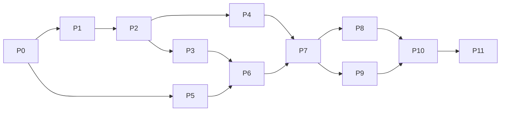

# Implementation Plan: LLM Valuation Agent Filing-Fidelity Study

| Item | Value |
|---|---|
| Source document | `llm_valuation_research_plan.md` (v0.1, 2026-10-05) |
| Plan version | v0.2 (2026-10-05: reflects resolved decisions D1, D2.2, D3.3, D3.5, D5, D5.2, D7.4, D8) |
| Date | 2026-10-05 |
| Assumed start | Week of 2026-10-19 (Week 1) |
| Target duration | ~24 weeks (pilot included) |

This document turns the research plan into a buildable sequence of phases. Each phase has concrete tasks, deliverables, and exit criteria. Section references like "§6.8" point to the research plan.

Detailed per-phase implementation plans (interfaces, commit-sized steps, tests) are in [`docs/plans/`](docs/plans/README.md). This roadmap stays the source of truth for phase order, dependencies, and open decisions.

---

## 0. Guiding Principles

1. **Measure deltas, not levels.** Every metric is computed relative to the agent's own baseline $V_0$. The pipeline never needs a "true" fair value.
2. **Raw is immutable.** Everything under `data/raw/` is stored exactly as downloaded, with a fetch timestamp. All transformations are re-runnable scripts.
3. **Every LLM call is cached and logged.** Cache key = hash(model id, prompt template version, input package hash, decoding config, repetition index). Re-running an experiment never re-bills a completed call.
4. **Freeze before you look.** Prompt templates, perturbation sizes, `n`, and primary hypotheses are frozen in `docs/preregistration.md` after the pilot and before the main run. Any later change goes into `docs/decisions_log.md` with a reason.
5. **Accounting consistency is enforced by code.** No perturbed package leaves the perturbation engine unless `check_identities()` passes.
6. **Validate the pipeline with synthetic agents before spending on real ones.** An "oracle" agent (perfect computation) and an "anchored" agent (constant output) must produce $\beta \approx 1$ and $\beta \approx 0$ respectively before any real model is run.

---

## 1. Phase Overview

| Phase | Name | Weeks | Depends on | Key deliverable |
|---|---|---|---|---|
| P0 | Project setup & pre-flight checks | 1–2 | — | Repo scaffold, data-access memo, model choice |
| P1 | Data acquisition | 3–4 | P0 | Raw DART/KRX/price data for the candidate universe |
| P2 | Sample selection & input packages | 4–5 | P1 | 150 standardized input packages + CB ground truth |
| P3 | Perturbation engine | 4–5 | P2 (schema only) | All perturbations with identity tests |
| P4 | Information conditions (redaction, fake names) | 5 | P2 | Condition A/B/D/C package variants |
| P5 | Agent, runner, parsing infrastructure | 3–6 | P0 | Plain agent (P), tool agent (T), cache, logger, validator |
| P6 | Metrics library & synthetic validation | 5–6 | P3, P5 | Metric functions validated on synthetic agents |
| P7 | Pilot & go/no-go | 6–8 | P1–P6 | Pilot report, preregistration |
| P8 | Main experiments | 9–13 | P7 | Full run logs, run-level dataset |
| P9 | Extension experiments | 12–15 | P7 (P8 partially) | RAG/tool comparison, comparison model, instruction effect |
| P10 | Analysis | 16–19 | P8, P9 | RQ1–RQ3 results, robustness tables, figures |
| P11 | Release & write-up | 20–24 | P10 | Paper draft, public code/data release |

P3, P4, and P5 can run in parallel once the input-package schema (P2.1) is fixed.



---

## 2. Phase P0 — Project Setup & Pre-flight Checks (Weeks 1–2)

### Goals
Stand up the repository and confirm that every external dependency (data fields, model cutoffs, pricing) actually exists before writing pipeline code.

### Tasks

**P0.1 Repository scaffold**
- Create the directory layout from §9.2 at the repo root (`config/`, `data/{raw,processed,ground_truth}/`, `src/{data,perturb,conditions,agents,runner,parse,metrics,analysis}/`, `tests/`, `notebooks/`, `results/`, `docs/`).
- `pyproject.toml` (Python ≥ 3.11) with: `requests`, `pandas`, `numpy`, `pyarrow`, `pydantic>=2`, `pyyaml`, `statsmodels`, `scipy`, `pykrx`, `yfinance`, `lxml`/`beautifulsoup4`, `tenacity`, `pytest`, `ruff`.
- `.env.example` for `DART_API_KEY`, `KRX_API_KEY`, model provider keys. `.gitignore` covering `.env`, `data/raw/`, `data/processed/`, cache DB, `results/runs/`.
- `docs/decisions_log.md` and `docs/preregistration.md` (empty templates).
- CI-free local workflow: `ruff check` + `pytest` must pass before each commit.

**P0.2 Configuration skeleton**
- `config/models.yaml`: model id, provider, endpoint, training cutoff (with source URL), temperature (default 0.3), max tokens, reasoning/non-reasoning flag.
- `config/sample.yaml`: evaluation dates `T_post`, `T_pre`; group definitions (L/M/S sizes, market, exclusion rules).
- `config/experiments.yaml`: per-module parameters (k grid, `n`, perturbation tiers 2/5/10%, `s* = 0.1`, `n_max = 40`).
- A single `src/config.py` loader that validates these files with pydantic.

**P0.3 Data-access verification (research plan §16)**
Write short probe scripts under `scripts/probes/` and record findings in `docs/data_access_memo.md`:
- OpenDART full financial statements API (`fnlttSinglAcntAll`): CFS vs OFS availability, account ID standardization (`account_id` / IFRS taxonomy codes), coverage for FY2022–FY2025.
- OpenDART original document download (`document.xml`): format and parsing difficulty.
- OpenDART major-event report for convertible bond issuance decisions: exact fields available (issue amount, conversion price, refixing floor, conversion period, call/put options).
- Whether outstanding CB balances are available as structured data; if not, locate the section in periodic reports for text parsing.
- Conversion-price adjustment (refixing) disclosures: search keywords and report codes.
- KRX Open API / pykrx: historical listing universe and market cap as of arbitrary past dates; industry classification.
- Adjusted price source (KRX vs yfinance `.KS`/`.KQ`) — pick one and record the adjustment convention.

**P0.4 Model selection**
- Confirm the primary open-weight model's training cutoff from official documentation (e.g., Llama 4 Scout, cutoff reported as Aug 2024).
- Confirm `T_post` and `T_pre` against that cutoff. `T_post` must fall after the cutoff (e.g., post-FY2024 annual reports, April 2025, or FY2025 reports, April 2026); `T_pre` before it (e.g., April 2023).
- Choose a hosted inference provider; record per-token price, context length, rate limits, and whether the model version is pinnable.
- Choose the comparison model (commercial API, preferably a reasoning model).

**P0.5 Literature check (non-code, tracked here for gating)**
Complete the remaining §16 checklist items. Any overlap discovered is recorded in the decisions log with a differentiation note.

### Deliverables
- Repo scaffold that installs and passes an empty `pytest` run.
- `docs/data_access_memo.md` with a yes/no/workaround for each data item.
- Filled `config/models.yaml` with verified cutoffs and prices.

### Exit criteria
- Every data item in §8 is marked "available" or has a documented workaround.
- Primary model and both evaluation dates are fixed.

---

## 3. Phase P1 — Data Acquisition (Weeks 3–4)

### Tasks

**P1.1 `src/data/dart_client.py`**
- Thin wrapper over OpenDART with: corp-code mapping download (`corpCode.xml`), financial statements by (corp_code, year, report code, CFS/OFS), disclosure search by date range and type, original document download.
- Rate limiting (OpenDART daily quota), retry with backoff (`tenacity`), and on-disk raw storage: `data/raw/dart/{endpoint}/{corp_code}/{year}_{reprt_code}.json` plus a `_meta.json` (URL, params, fetched_at, HTTP status).
- Idempotent: skip if the raw file already exists unless `--refresh`.

**P1.2 `src/data/krx_client.py`**
- Listed universe as of a date (KOSPI, KOSDAQ), market cap, shares outstanding, industry classification, administrative-issue / trading-halt flags.
- Raw storage: `data/raw/krx/{dataset}/{YYYYMMDD}.parquet`.

**P1.3 `src/data/price_client.py`**
- Daily adjusted close for each ticker over [`T_pre − 2y`, `T_post + 1m`].
- Helper `price_on(ticker, date)` that returns the last trading-day close on or before `date`.
- Raw storage: `data/raw/prices/{ticker}.parquet`.

**P1.4 CB data collection**
- For all KOSDAQ firms in the candidate pool: pull CB issuance decision filings and refixing filings up to `T_post`.
- Download the latest periodic report before `T_post` and extract the outstanding-CB table (structured API if available, else HTML/XML parsing in `src/data/cb_parser.py`).

**P1.5 Tests**
- Recorded-response fixtures (a handful of saved JSON/XML files) under `tests/fixtures/` so client parsing is tested without network calls.

### Deliverables
- Raw data for the full candidate universe at `T_post` (and `T_pre` for E7 candidates).
- `scripts/fetch_all.py` that reproduces the raw layer from scratch.

### Exit criteria
- ≥ 95% of candidate firms have three years of consolidated statements fetched.
- CB issuance and outstanding-balance data available for the KOSDAQ candidate pool (or gap documented).

---

## 4. Phase P2 — Sample Selection & Input Packages (Weeks 4–5)

### Tasks

**P2.1 Input package schema (`src/data/package_schema.py`)** — *fix this first; P3/P4 depend on it.*
A pydantic model, serialized as JSON:
```
InputPackage
├── firm_id            # internal stable id (not the ticker)
├── meta               # corp_code, ticker, real_name, industry_label, group (L/M/S), eval_date
├── unit = "KRW_million"
├── years: [Y-2, Y-1, Y]
├── bs[year]: {cash, short_term_investments, receivables, inventory, ..., total_assets,
│              short_term_borrowings, long_term_borrowings, bonds, convertible_bonds, ...,
│              total_liabilities, paid_in_capital, retained_earnings, ..., total_equity}
├── is[year]: {revenue, cogs, operating_income, interest_income, interest_expense,
│              pretax_income, income_tax, net_income, net_income_controlling, ...}
├── cf[year]: {cfo, depreciation_amortization, capex, cfi, dividends_paid, cff,
│              net_change_in_cash, beginning_cash, ending_cash, ...}
├── per_share[year]: {eps, dps}
├── shares: {issued, treasury, outstanding}
├── notes: {borrowings_detail, non_operating_assets_detail}   # structured + short text
├── cb: {instruments: [{face_outstanding, conversion_price, refix_floor, maturity, ...}],
│        filing_text}                                          # small caps only
└── field_tags: {field_name: "monetary" | "count" | "ratio" | "per_share"}
```
`field_tags` is what lets the perturbation engine know which fields to scale.

**P2.2 Account standardization (`src/data/account_map.py`)**
- Map DART account IDs (IFRS taxonomy) to the canonical field names above; fall back to account-name matching with a reviewed synonym table.
- Unit conversion to KRW million; sign conventions (outflows negative in CF).
- Log unmapped accounts per firm; firms missing any *required* field are flagged.

**P2.3 Sample selection (`src/data/sample.py`)**
Apply §6.2 rules as of `T_post`:
- Exclude financials (banks, insurers, securities), administrative issues, trading halts, prior-year capital impairment, firms without three years of consolidated statements.
- **L**: top-50 KOSPI by market cap after exclusions.
- **M**: 50 KOSPI firms ranked 101–400 by market cap after exclusions. Split into 5 market-cap quintiles; in each, pick 5 firms from the top and 5 from the bottom tercile of "newsworthiness" (count of DART filings in the 12 months before `T_post`). This breaks the $M_i$–market-cap collinearity (D8, D2.5).
- **S**: 50 KOSDAQ firms with outstanding unconverted CBs whose conversion price < market price at `T_post` (in the money). Prefer plain CBs (refixing only); tag firms with call options / net-settlement terms as `cb_complex=True` for the robustness split.
- Output `data/processed/sample.parquet` with selection reason and all exclusion flags.

**P2.4 Package builder (`src/data/package_builder.py`)**
- Assemble one `InputPackage` per firm, run `check_identities()` (see P3.1) on the *unperturbed* package. Firms whose reported statements fail identities beyond a tolerance (e.g., 0.5% of total assets) are fixed with an explicit "other" plug line or excluded — record which.
- Render function `render_package(pkg, condition) -> str` producing the user-prompt blocks of Appendix B (financial statements, share info, notes, additional filings).

**P2.5 Ground truth (`data/ground_truth/`)**
- `cb_truth.parquet`: per small-cap firm, outstanding face value $F$, current conversion price $P_c$ (after refixing), convertible shares $F/P_c$.
- `quiz_truth.parquet`: per firm and evaluation date, market cap, prior-year revenue, prior-year operating income, price, main business, listing market (for E6).
- `anchor_prices.parquet`: $P^{old}_i$ (price at model cutoff) and $P^{new}_i$ (price at `T_post`) for E7.

### Deliverables
- 150 validated input packages in `data/processed/packages/{firm_id}.json`.
- Ground-truth tables.

### Exit criteria
- All 150 packages pass `check_identities()`.
- ≥ 30 in-the-money small caps with clean CB ground truth (pilot gate G5 pre-check).

---

## 5. Phase P3 — Perturbation Engine (Weeks 4–5)

All functions are pure: `perturb(pkg, params) -> (new_pkg, meta)`, where `meta` carries everything the metrics need to compute the theoretical change.

### Tasks

**P3.1 `src/perturb/consistency.py`**
`check_identities(pkg, tol)` enforces, for every year:
1. Total assets = total liabilities + total equity
2. Net income ties to the income statement bottom line
3. Ending cash = beginning cash + net change in cash (and ending cash = BS cash)
4. EPS ≈ net income attributable to controlling interest ÷ weighted shares (tolerance-based)
Plus subtotal checks (current + non-current = total) where subtotals are present.

**P3.2 Scale perturbation (`scale.py`)**
- Multiply every `monetary` field in every year by `k`; multiply `per_share` monetary fields (EPS, DPS) by `k`; leave counts and ratios unchanged.
- Theoretical: $V^*(k) = V_0 \cdot k$.
- Grid: k ∈ {0.5, 0.8, 1.0, 1.25, 2.0}.

**P3.3 Cash distribution (`cash_distribution.py`)**
- Latest year only: cash −X, retained earnings −X, total assets −X, total equity −X, CF dividends paid −X (more negative), CFF −X, net change in cash −X. P&L unchanged (documented simplification: forgone interest income ignored).
- Guard: X ≤ cash; X ≤ 10% of equity value; post-change debt ratio within industry normal range.
- Theoretical: $\Delta V^* = -X / N_{\text{outstanding}}$.

**P3.4 Share-count perturbation (`shares.py`)**
- Issued, treasury, outstanding × m; EPS and DPS ÷ m (all years).
- Theoretical: $V^* = V_0 / m$.

**P3.5 Non-operating asset perturbation (`non_operating.py`)**
- Long-term investment assets +X and equity +X (counterpart: decide between retained earnings and OCI — record in decisions log; recommended: OCI/other equity so the P&L is untouched). Update the notes' non-operating asset detail consistently.
- Theoretical: $\Delta V^* = +X / N_{\text{outstanding}}$.

**P3.6 CB perturbations (`cb.py`)**
| Variant | Package edit | Notes |
|---|---|---|
| V0 | Include CB filing text + outstanding table | Baseline |
| V1 | Remove CB terms text and table; keep the bond liability on the BS | Presence test |
| V2 | $F \times 2$ in terms, table, and BS liability; balance with cash +ΔF (as if a second tranche was issued for cash) | Keeps $E$ unchanged, so the theoretical change isolates dilution. Record choice in decisions log |
| V3 | Lower $P_c$ within the refixing floor: $P_c^{new} = \max(\text{floor}, 0.5 P_c)$; floor assumed 70% of the initial price if not disclosed; firms already at the floor are excluded from V3 (D3.3) | BS unchanged |
| V4 | Add a placebo filing: a fully redeemed historical CB or an irrelevant filing (e.g., head-office relocation) | Specificity test |

Text edits in filing documents must update every occurrence of the amount/price (numeric and Korean-numeral formats); write a helper with tests for formats like `20,000,000,000원`, `200억원`, `8,000원`.

**P3.7 Size rule helper (`src/perturb/sizing.py`)**
Implements §6.8:
- Lower bound: $|\Delta V^*_i| \ge \sigma_i\sqrt{2/n}/s^*$.
- Floor: at least 5% of the agent's baseline equity value (D3.5), so perturbation size is comparable across firms.
- Upper bound: 10% of equity value, cash non-negative, debt ratio in range.
- Size = max(lower bound, 5% floor), capped at the upper bound. Expressed as a fraction of the firm's equity value; returns `(x, n)` or `excluded` with reason, increasing `n` up to 40 when the lower bound exceeds the upper bound.
- Also emits the fixed 2% / 5% / 10% tiers.

**P3.8 Tests (`tests/test_perturb_*.py`)**
- Every perturbation on every fixture package passes `check_identities()`.
- Property tests: `scale(scale(pkg, a), b) == scale(pkg, a*b)`; `shares(pkg, 1) == pkg`; cash distribution with X=0 is identity.
- CB text replacement round-trip tests.

### Exit criteria
- 100% of perturbations on all 150 packages pass identity checks (scripted sweep).

---

## 6. Phase P4 — Information Conditions (Week 5)

### Tasks

**P4.1 `src/conditions/redactor.py`**
- Condition A (numbers only): remove company name, ticker, brand/product names, subsidiary names, address, CEO name; replace segment names with "Segment 1/2/…"; remove industry label.
- Condition B: A + generic industry label (e.g., "a domestic semiconductor manufacturer").
- Condition D: B + assigned fake name.
- Condition C: real name + industry label.
- Pass 1: dictionary/regex removal using known identifiers from DART company info (name variants, English name, subsidiaries from notes, brand list).
- Pass 2: LLM-based residual check ("list any tokens that could identify the company") on the rendered text; flagged tokens are reviewed and added to the dictionary.
- Pass 3: manual review of 10% of firms; log results in `docs/redaction_audit.md`.

**P4.2 `src/conditions/fake_names.py`**
- Generate industry-plausible Korean company names (template-based, e.g., `{prefix}{industry-suffix}` such as "한빛정밀", "대성테크").
- Reject names that exactly match or are too similar to any KRX-listed name (normalized edit distance / Jaro-Winkler threshold) — compare against the full historical listing.
- Assign one fixed fake name per firm, stored in `data/processed/fake_names.parquet`.

**P4.3 Tests**
- No real-name token survives in A/B/D renders for any fixture.
- Fake names never collide with the KRX list.

### Exit criteria
- Redaction audit completed with zero unremoved direct identifiers in the reviewed 10%.

---

## 7. Phase P5 — Agent, Runner, and Parsing Infrastructure (Weeks 3–6)

### Tasks

**P5.1 Output schema (`src/parse/schema.py`)**
- Pydantic models mirroring Appendix A (`extracted`, `assumptions`, `calculation`, `dilution`, `result`, `meta`).
- Add two fields to support unambiguous recomputation: `calculation.discounting_convention` (`"end_of_year" | "mid_year"`) and `calculation.shares_used_for_per_share` (the denominator actually used). Record in decisions log.
- Field-level validators: arrays of length 5, WACC > terminal growth, numeric types.

**P5.2 Prompt templates (`src/agents/prompts/`)**
- Store system and user templates from Appendix B as versioned files (`valuation_system_v1.txt`, …). Template version is part of the cache key.
- Instruction-condition variant (rule 6) as a separate template version.
- Prompts for E5 (identification) and E6 (memory quiz) as separate templates.
- Decide prompt language (Korean as drafted) and keep it fixed.

**P5.3 LLM client abstraction (`src/agents/llm_client.py`)**
- One interface `complete(messages, model_cfg, seed=None) -> RawResponse` with adapters for an OpenAI-compatible endpoint (open-weight hosting) and the commercial comparison model's SDK.
- Captures: model id/version string returned by the API, timestamps, latency, input/output tokens, finish reason, refusal detection.
- Concurrency control (async or thread pool) and provider rate limits.

**P5.4 Agents (`src/agents/`)**
- `base.py`: `Agent.run(package, condition, prompt_version, rep) -> RunRecord`.
- `plain.py` (structure P): render package → single call → JSON.
- `tool.py` (structure T): the model extracts values and sets assumptions (structured output); `valuation_tools.py` performs discounting, terminal value, EV → equity → per-share, and dilution. Build this now because pilot gate G2 may require switching to T as the primary structure.
- `valuation_tools.py`: canonical FCFF DCF implementation, also reused for self-consistency recomputation and the oracle synthetic agent.
- `rag.py` (structure R): deferred to P9.

**P5.5 Validation & retry (`src/parse/validate.py`)**
- Extract JSON (strip code fences, tolerate trailing text), validate against schema.
- On failure: up to 2 re-requests with the validation error appended; then record as `schema_failure` with the raw text.
- Pre-defined missing-data rules: failed runs are excluded from medians; firm-condition cells with < 70% valid runs are flagged.

**P5.6 Runner, cache, logger (`src/runner/`)**
- `cache.py`: SQLite table `calls(key PRIMARY KEY, model, prompt_version, package_hash, decoding_hash, rep, response_json, created_at)`.
- `logger.py`: append-only JSONL per experiment (`results/runs/{experiment}/{date}.jsonl`) with full raw responses and metadata.
- `run.py`: CLI `python -m src.runner.run --experiment E2 --group L --condition C --model primary [--dry-run] [--limit N]`.
  - Builds the job list (firm × condition × perturbation × rep), skips cached keys, executes, validates, writes a **run-level table** to `results/runs/{experiment}.parquet`:
    `firm_id, group, experiment, condition, perturbation_type, perturbation_param, rep, model, prompt_version, agent_structure, valid, value_per_share, anomaly_flag, tokens_in, tokens_out, ...` plus the parsed JSON.
  - `--dry-run` prints job count and estimated cost from `config/models.yaml` prices.

**P5.7 Synthetic agents (`src/agents/synthetic.py`)**
- `OracleAgent`: reads the package, applies fixed assumptions through `valuation_tools`, adds multiplicative log-normal noise. Expected: $\beta = 1$, $R = 1$, $\epsilon \approx 0$.
- `AnchoredAgent`: returns a fixed value per firm plus noise. Expected: $\beta = 0$, $R = 0$.
- `MixtureAgent(w)`: $V = V_{oracle}^{w} \cdot V_{anchor}^{1-w}$. Expected: $\beta = w$.
- `NoDilutionAgent`: ignores CB info. Expected: $R_{dil} = 0$, E9 class "reflection failure".

### Exit criteria
- End-to-end dry run of E2 on 3 firms with the plain agent produces valid parsed records.
- Re-running the same command makes zero API calls (cache hit 100%).

---

## 8. Phase P6 — Metrics Library & Synthetic Validation (Weeks 5–6)

### Tasks

| Module | Function(s) | Spec |
|---|---|---|
| `metrics/baseline.py` | `baseline(runs)` | $V_0$ = median, $\sigma$ = SD across reps, schema compliance rate (E0) |
| `metrics/elasticity.py` | `firm_elasticity(df)` | OLS of $\log V$ on $\log k$ per firm×condition, HC3 SE; drop non-positive values and record count; optional quadratic term for nonlinearity |
| `metrics/response.py` | `response_ratio`, `dose_response_slope`, `min_perturbation` | §5.2; bootstrap CI (1,000 resamples of reps); slope of actual vs theoretical change across V1–V3 |
| `metrics/self_consistency.py` | `recompute_value(output)`, `epsilon(output)` | Recompute per-share value from reported assumptions via `valuation_tools`; use the reported discounting convention; also compute under the alternative convention and report both (primary = reported) |
| `metrics/decomposition.py` | `decompose(betas)` | $\beta_A-\beta_B$, $\beta_B-\beta_D$, $\beta_D-\beta_C$, $E_i$, with bootstrap SEs |
| `metrics/memory_quiz.py` | `score_quiz(responses, truth)` | ±20% numeric tolerance, sign check for Q3, "don't know" = 0, mean over 3 reps → $M_i$; extract $\hat P^{mem}_i$ from Q4 |
| `metrics/identification.py` | `identification_rate(responses, firm)` | Fuzzy match of the model's guess to real name/ticker; rate per firm×condition |
| `metrics/dilution.py` | `theoretical_diluted_value(E, N, F, Pc)` | §E8; uses the agent's own pre-dilution $E$ per run; returns $v^*$, $v_{debt}$, $\Delta V^*$ |
| `metrics/failure_modes.py` | `classify(output, truth)` | E9 order: extraction (±5%) → reflection (shares used = basic shares) → computation (±2%) → success |
| `metrics/firm_table.py` | `build_firm_table()` | Joins everything into one firm-level dataset (`results/firm_level.parquet`) |

### Synthetic validation (`tests/test_metrics_synthetic.py`)
Run the full E0–E3 and E8 pipeline on 10 fixture firms with synthetic agents (no API calls):
- Oracle: mean $\hat\beta \in [0.95, 1.05]$, $R \in [0.9, 1.1]$, $\epsilon < 1\%$.
- Anchored: $|\hat\beta| < 0.05$.
- Mixture(0.6): $\hat\beta \in [0.55, 0.65]$.
- NoDilution: $R_{dil} \approx 0$; E9 classifies ≥ 95% as reflection failure.
- Worked example from §E8 ($E$=100bn, $N$=10m, $F$=20bn, $P_c$=8,000) returns $v_{conv}$ = 9,600 and $\Delta V^*$ = −400.

### Exit criteria
- All synthetic checks pass. This is a hard gate before any paid pilot call.

---

## 9. Phase P7 — Pilot & Go/No-Go (Weeks 6–8)

### Scope (§12.1)
10 large caps + 10 small caps, primary model, structure P:
- E0 (n = 20, to check the stability of σ), E1 on all outputs, E2 with conditions C and A only, E3 cash distribution only, E8 V0/V1/V2/V3 (V3 added to check the anomaly-flag rate under D3.3).
- Also measure: tokens per call (actual), latency, refusal rate, anomaly-flag rate.

### Tasks
1. Run pilot via the runner with a dedicated `--tag pilot` (separate cache namespace not required; prompt version is the same).
2. `src/analysis/pilot_report.py` generates `docs/pilot_report.md` with the gate table below.
3. Compute per-firm $\sigma_i$ and use the sizing helper to set $n$ and perturbation sizes for the main run.
4. Measured token counts → updated cost estimate for P8/P9 (`--dry-run` totals).
5. Decide and record: final `n` policy (per-firm, min 5, max 40), k grid (reduce A/B grid to {0.5, 1.0, 2.0} if budget-bound), primary agent structure.

### Gates (§12.2)
| Gate | Pass condition | If failed |
|---|---|---|
| G1 Schema | ≥ 95% compliance incl. retries | Simplify schema / prompt; consider model swap |
| G2 Calculation | < 30% of runs with $\epsilon > 5\%$ | Switch primary structure to T |
| G3 Signal | Observable gap between $\beta_C$ and $\beta_A$ in large caps | Re-weight toward RQ3 + H4; still report RQ1 |
| G4 Measurability | ≥ 80% of firms have a feasible size interval with $n \le 20$ | Raise `n` or drop noisy firms |
| G5 Data | ≥ 30 ITM CB small caps with ground truth | Extend sample window; consider BWs |

### Deliverables
- `docs/pilot_report.md`.
- `docs/preregistration.md` frozen: hypotheses (primary vs exploratory), perturbation sizes, `n`, k grid, exclusion rules, missing-data rules, tests and Holm correction, prompt template versions (hashes).
- Git tag `prereg-v1`.

### Exit criteria
- All gates evaluated and decisions logged; preregistration committed and tagged.

---

## 10. Phase P8 — Main Experiments (Weeks 9–13)

Primary model, primary structure, all 150 firms unless noted. Run in this order so that early modules feed later ones:

| Order | Module | Scope | Approx. calls (n=10) |
|---|---|---|---|
| 1 | E6 memory quiz | 150 firms × 3 reps | ~450 (short) |
| 2 | E0 + E2 scale | 4 conditions × 5 k × n | ~30,000 |
| 3 | E5 identification | Conditions A/B/D × k∈{1, 1.5} × 3 reps | ~2,700 (short) |
| 4 | E3 single-item | Cash, shares, non-operating × n (+ 2/5/10% tiers) | ~4,500 + tiers |
| 5 | E7 stale anchor | ~40 firms with $\lvert\log(P^{new}/P^{old})\rvert \ge 0.3$; conditions A and C | ~400 |
| 6 | E8 CB dilution | 50 small caps × V1–V4 × n | ~2,000 |
| — | E1, E9 | Computed offline from E0–E8 outputs | 0 |

Notes:
- E5 at k = 1.5 requires one extra scale variant not in the E2 grid; generate it with the same engine.
- E7 as specified in §6.7 uses `T_post` filings (conditions A and C at k = 1, which are E2 cells) and the cutoff-date price as a regressor, so it needs no `T_pre` packages. §6.3 still lists `T_pre` "for E7"; this is resolved as D7.4 in the pilot (drop `T_pre`, or keep an optional pre-cutoff E2 replication).

### Operational tasks
- Batch by module and group; checkpoint after each batch (cache makes resume trivial).
- Daily monitoring script `scripts/monitor.py`: valid-run rate, anomaly-flag rate, refusal rate, spend vs budget. Stop and investigate if valid rate drops below 90% in any batch.
- Record the provider-reported model version for every call; halt if it changes mid-run and log in decisions log.
- After each module: regenerate `results/firm_level.parquet` incrementally.

### Exit criteria
- All modules complete with ≥ 95% valid runs overall; every firm-condition cell either complete or flagged with reason.

---

## 11. Phase P9 — Extension Experiments (Weeks 12–15)

| Extension | Scope | Implementation work |
|---|---|---|
| Structure R (RAG) | 30 firms, E2 condition C (50 runs) + 20 small caps E8 (40 runs) | `src/agents/rag.py`: chunk rendered package/filings, embed, retrieve per schema field; same output schema |
| Structure T (tool) | Same scope as R (if not already primary) | Already built in P5.4 |
| Comparison model | 30 firms, E2 conditions C and D | Adapter config only |
| Instruction effect | 30 firms, E2 condition C, with vs without rule 6 | New prompt version |
| E10 info position (optional) | Subset of small caps; CB info at start vs mid-document | Renderer option `cb_position = "front" | "middle"` |

Exit criteria: each extension produces its own run-level table, joined into the firm-level dataset with an `agent_structure` / `model` / `prompt_version` column.

---

## 12. Phase P10 — Analysis (Weeks 16–19)

All tables and figures are produced by scripts in `src/analysis/`, never by notebooks. Each script writes to `results/tables/` and `results/figures/`.

**`rq1.py`**
- H1: one-sided test that the inverse-variance-weighted mean of large-cap $\beta_C < 1$; unweighted mean and Wilcoxon signed-rank as robustness.
- Pooled mixed-effects model: $\log V_{i,k,r} = a_i + (b + b_S \text{Small}_i + b_M \text{Mid}_i)\log k + e$ (statsmodels `MixedLM` or OLS with firm FE and firm-clustered SEs). H1b: $b_S > 0$.
- Nonlinearity: per-firm quadratic term in $\log k$.
- H1c: $\epsilon$ distributions by group.

**`rq2.py`**
- H2a: Wilcoxon on $E_i > 0$; decomposition table (four components, share of total attenuation).
- H2b: WLS/OLS of $E_i$ on $M_i$, log market cap, industry dummies, condition-D identification rate; HC3 SEs; VIFs; stratified analysis by market-cap bins if VIF is high.
- H2c: E7 regression $\log V_C = a + b_1 \log V_A + b_2 \log P^{old} + e$.
- H2d: test $\beta_A - \beta_B$; compare by industry with Lee et al. (2025) direction.

**`rq3.py`**
- H3: mean $R_{dil}$ (V0 vs V1) < 1.
- H3c: per-firm dose-response slope across V1–V3; test slope < 1; inspect intercept.
- Specificity: TOST equivalence on V4 with margin ±$\sigma_i$.
- H3b: failure-stage proportions with CIs, by agent structure.

**`robustness.py`** — every row of §7.5: exclude identified firms; 2/5/10% tiers; half-`n` resampling; anomaly-flag runs in/out; comparison model; instruction effect; complex CBs in/out.

**Multiple comparisons** — Holm correction across H1, H2a, H2b, H3 only; all others labeled exploratory with effect sizes and CIs.

**Deliverable** — `results/summary.md` auto-generated with key numbers, plus publication-ready tables (CSV + LaTeX) and figures.

Exit criteria: every hypothesis in §4.2 has a result row (supported / not supported / inconclusive) traceable to a script.

---

## 13. Phase P11 — Release & Write-up (Weeks 20–24)

- Paper draft (target: FinNLP-type workshop first; ICAIF or KCI journal depending on results).
- Public release: code, prompt templates, perturbation functions, output schema, firm-level metric dataset, `scripts/fetch_all.py`. **No raw DART/KRX redistribution.**
- `README.md` with a "reproduce from scratch" section: install → set keys → fetch → build packages → run (or load cached responses) → analysis.
- Freeze a release tag; archive raw responses (JSONL) privately for audit.

---

## 14. Testing Strategy Summary

| Layer | What is tested | Where |
|---|---|---|
| Data clients | Parsing of recorded API responses | `tests/test_data_*.py` + fixtures |
| Account mapping | Required fields mapped for fixture firms | `tests/test_account_map.py` |
| Perturbations | Identities, composition properties, text replacement | `tests/test_perturb_*.py` |
| Redaction | No identifier leakage, fake-name non-collision | `tests/test_conditions.py` |
| Parsing | Malformed JSON recovery, retry logic, schema validators | `tests/test_parse.py` |
| Runner | Cache key stability, resume, dry-run cost | `tests/test_runner.py` |
| Metrics | Analytic examples + synthetic-agent recovery | `tests/test_metrics_*.py` |
| Full sweep | All 150 packages × all perturbations pass identities | `scripts/sweep_identities.py` |

---

## 15. Budget Control

- `--dry-run` cost estimate is mandatory before every paid batch; compare against the remaining budget in `config/budget.yaml`.
- Main-run budget levers, in order of preference (§10.4): per-firm `n` (5 for low-noise firms), compressed packages, cheaper hosting for the open-weight model, reducing the A/B k grid to three points.
- Extension experiments (P9) start only after the P8 spend is known.

---

## 16. Open Decisions (to resolve and record in `docs/decisions_log.md`)

| # | Decision | Needed by | Recommendation |
|---|---|---|---|
| D1 | `T_post`: FY2024 (Apr 2025) vs FY2025 (Apr 2026) reports | P0 | **Rule resolved**: ≥ 3 months after the verified cutoff; prefer FY2025. Final date set in P0 |
| D2 | Equity counterpart for non-operating asset perturbation | P3 | OCI / other equity (keeps P&L unchanged) |
| D3 | Balancing entry for CB V2 | P3 | Cash +ΔF, so $E$ is unchanged |
| D4 | Discounting convention field in schema | P5 | Add field; recompute under reported convention |
| D5 | Prompt language (Korean vs English) | P5 | **Resolved**: Korean |
| D6 | Primary agent structure | P7 | P unless G2 fails |
| D7 | Treatment of firms failing reported-statement identities | P2 | Plug line if < 0.5% of total assets, else exclude |
| D8 | "Newsworthiness" proxy for mid-cap selection | P2 | **Resolved**: DART filing count over the prior 12 months |

Phase-local decisions (`Dn.k`) are listed in each phase plan under `docs/plans/`. Resolved decisions, with reasons, are in [`docs/decisions_log.md`](docs/decisions_log.md). As of 2026-10-05:
- **Resolved**: D1 (selection rule), D5 (Korean), D8, D2.2, D2.5, D3.3, D3.5, D5.2, D7.4.
- **Pending**: D2, D3, D4, D6, D7, and the remaining phase-local decisions.
- **Research-plan deviations**, reflected in research plan v0.2: D3.3 (V3 price), D3.5 (5% size floor), D7.4 (`T_pre` role), D5.2 (tool agent design and cost), D2.2 (notes derived from the balance sheet).

---

## 17. Phase Checklist

- [ ] P0 Repo scaffold, configs, data-access memo, model and dates fixed
- [x] P1 Raw data fetched and reproducible (KOSDAQ prices provisional until KRX approval)
- [x] P2 150 packages + ground truth (small-cap selection provisional; manual checks pending)
- [x] P3 Perturbation engine with full identity sweep passing (human read of V2/V3 texts pending)
- [x] P4 Redaction audit complete, fake names assigned (manual audit and fake-name review pending)
- [x] P5 Plain + tool agents, cache, validator, runner working end to end (smoke 11/12 valid)
- [x] P6 Metrics validated on synthetic agents
- [ ] P7 Pilot report, gates evaluated, preregistration tagged
- [ ] P8 Main experiments complete
- [ ] P9 Extensions complete
- [ ] P10 All hypotheses analyzed, robustness done
- [ ] P11 Paper draft and public release
