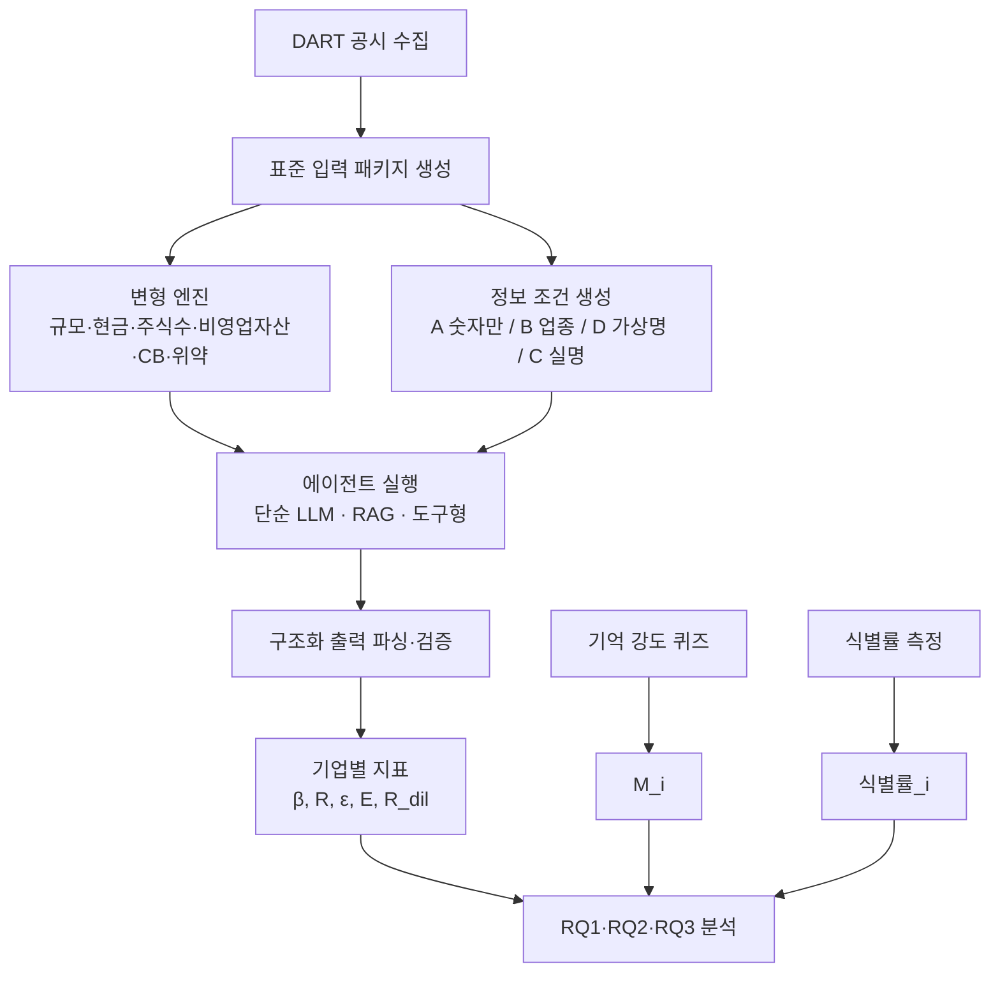

# LLM 밸류에이션 에이전트의 공시 정보 충실도 연구

## 기획보고서 및 연구 프로세스·구현 계획 (v0.2)

| 항목 | 내용 |
|---|---|
| 작성일 | 2026-10-05 |
| 문서 상태 | 착수 전 기획안. 파일럿 결과에 따라 수정 예정 |
| 개정 이력 | v0.2 (2026-10-05): T_pre 역할 축소(6.3), 중형주 선정 방식 구체화(6.2), 도구형 에이전트 설계(6.4, 10.3), 주석 요약 도출 방식(6.5), V3 전환가액 변형(6.7 E8), 변형 크기 최소 5% 바닥(6.8), 파일럿 범위(12.1) 반영. 결정 근거는 `docs/decisions_log.md` 참고 |
| 가제 (국문) | LLM 밸류에이션 에이전트는 공시를 읽고 계산하는가, 기억한 가격을 정당화하는가: 한국 상장기업 대상 변형 테스트 |
| 가제 (영문) | Do LLM Valuation Agents Compute from Filings or Recall from Memory? Metamorphic Tests on Korean Listed Firms |
| 예상 기간 | 약 6개월 (파일럿 포함) |

---

## 목차

1. 연구 요약
2. 연구 배경과 문제의식
3. 선행연구와 본 연구의 위치
4. 연구 질문과 가설
5. 핵심 개념의 조작적 정의
6. 연구 설계
7. 분석 계획
8. 데이터 수집 계획
9. 구현 계획
10. 호출량과 비용 추정
11. 일정
12. 파일럿 계획과 진행·중단 기준
13. 리스크와 대응
14. 기대 성과와 투고 전략
15. 향후 확장: 투자 신호로의 연결
16. 착수 전 확인 체크리스트
17. 부록 (출력 스키마, 프롬프트 초안, 기억 강도 퀴즈, 용어집, 참고문헌)

---

## 1. 연구 요약

LLM과 LLM 기반 에이전트가 기업 분석과 밸류에이션에 빠르게 도입되고 있지만, 이들이 산출한 적정가치가 실제로 제공된 공시 자료에서 계산된 것인지, 아니면 모델이 학습 과정에서 기억한 시장가격과 컨센서스에 맞춰 그럴듯하게 정당화된 것인지는 결과값만으로 구분할 수 없다. 시장이 대체로 효율적이라면 공시로 제대로 계산한 값도 시장가 근처에 오기 때문이다.

본 연구는 정답 가치 대신 **정답 변화량**을 이용해 이 문제를 식별한다. 재무제표의 모든 금액을 k배 하면 주당가치도 정확히 k배가 되어야 하고, 영업과 무관하게 현금만 X원 줄이면 주주가치는 정확히 X원 줄어야 한다. 이처럼 입력 변화에 대한 출력 변화의 크기가 재무 이론상 정해진 관계(변형 관계, metamorphic relation)를 이용해, LLM 밸류에이션이 공시 변화에 얼마나 충실하게 반응하는지를 연속적이고 보정된 지표로 측정한다.

연구는 세 가지 질문을 다룬다. 첫째, LLM 밸류에이션은 공시 변화에 재무적으로 정해진 크기만큼 반응하는가(RQ1). 둘째, 반응이 둔화된다면 그 원인은 기업 특정 기억인가, 업종·규모에 대한 일반적 사전 믿음인가(RQ2). 셋째, 기업 특정 기억이 거의 없는 코스닥 소형주에서 LLM은 공시의 핵심 정보(전환사채 희석 요인)를 실제로 가치 산출에 반영하는가(RQ3).

대상은 한국 유가증권시장 대형주·중형주와 미전환 전환사채(CB)를 보유한 코스닥 소형주이며, 입력 자료는 OpenDART 공시를 사용한다. 학습 기준일이 공개된 모델을 포함해 평가 시점을 기준일 이전과 이후로 나눔으로써 기억의 영향을 시점으로도 식별한다.

---

## 2. 연구 배경과 문제의식

### 2.1 LLM 밸류에이션의 확산

증권사, 운용사, 개인투자자 도구에서 LLM이 재무제표를 읽고 적정가치를 제시하는 기능이 확산되고 있다. 오픈소스 금융 에이전트 프레임워크(예: FinRobot)와 상용 딥리서치 에이전트들은 리서치 리포트 작성과 DCF 산출을 기본 기능으로 시연한다. 이런 도구의 신뢰성은 결국 "모델이 준 자료로 계산했는가"에 달려 있다.

### 2.2 결과 정확도 평가의 식별 문제

기존 평가 연구는 AI가 낸 목표가나 실적 예측이 실제 결과와 얼마나 가까운지를 본다(Haque et al., 2026). 그러나 이 방식은 두 가지 설명을 구분하지 못한다. 하나는 모델이 공시 자료로 가치를 계산했다는 설명이고, 다른 하나는 모델이 이미 학습한 주가·컨센서스·사후 실적을 출력에 반영했다는 설명이다. 실제로 Haque et al.(2026)은 AI 리포트를 사후에 생성하면서 "특정 날짜 이전 정보만 사용하라"는 프롬프트 제약을 두고 인용 출처의 날짜만 확인했는데, 이는 웹 출처를 통제한 것이지 모델 내부 기억을 통제한 것이 아니다.

### 2.3 두 가지 상황: 충돌과 부재

대형주에서는 모델이 그 기업에 대해 많이 기억하므로, 공시와 기억이 다른 답을 가리킬 때 어느 쪽이 결과를 지배하는가(**충돌 상황**)가 문제다. 코스닥 소형주에서는 모델이 그 기업을 거의 모르므로, 공시 속 핵심 정보를 실제로 계산에 반영하는가(**부재 상황**)가 문제다. 두 상황은 같은 질문, 즉 "LLM 밸류에이션은 공시에 충실한가"의 양면이다.

### 2.4 기억의 두 종류

밸류에이션은 공시만으로 완성되지 않는다. 할인율, 영구성장률, 업종 평균 배수 같은 가정은 공시에 없으며 모델이 일반 금융 지식으로 채워야 한다. 이는 정당한 기억 사용이다. 문제가 되는 것은 그 기업의 현재 주가, 컨센서스 목표가, 사후 실적처럼 **기업 특정 결과 정보**가 공시 데이터를 덮어쓰는 경우다. 본 연구는 모델 내부 지식을 다음 두 가지로 구분한다.

| 구분 | 예시 | 밸류에이션에서의 역할 |
|---|---|---|
| 일반 금융 지식 | 업종 평균 할인율, 성장률 관행, 회계 지식, 업종에 대한 일반적 선입견 | 필요하며 정당함. 단 업종 선입견은 왜곡 요인이 될 수 있음 |
| 기업 특정 기억 | 그 기업의 시가총액, 주가, 컨센서스, 사후 실적 | 공시 기반 평가를 오염시키는 요인 |

---

## 3. 선행연구와 본 연구의 위치

### 3.1 지식 충돌 연구 (NLP)

외부 문맥 정보가 모델 내부 지식과 충돌하는 현상은 지식 충돌(knowledge conflict)로 연구되어 왔다. Longpre et al.(2021)은 질의응답에서 개체를 치환해 모델이 문맥과 기억 중 무엇을 따르는지 측정했고, Xie et al.(2023)은 모델이 내부 지식을 지지하는 증거에 매달리는 확증 편향을 보였으며, Xu et al.(2024)은 이를 문맥-기억, 문맥 간, 기억 내 충돌로 분류한 서베이를 냈다. Sun et al.(2025)은 지식 충돌의 영향이 과제의 지식 요구 수준에 따라 다르며, 문맥 준수를 무조건 강제하는 것도 해로울 수 있음을 보였다.

이 문헌의 과제는 대부분 단일 사실 질의응답으로, 결과가 "문맥을 따랐다/기억을 따랐다"의 이분법이다.

### 3.2 금융 LLM의 투자 편향 (Lee et al., 2025)

Lee et al.(2025)은 S&P 500 427개 종목에 대해 같은 강도(±5%)의 매수·매도 근거를 균형 있게 제시하고 매수/매도 결정을 관찰했다. 모델들은 기술주, 대형주, 역추세 전략을 선호했고, 반대 근거가 더 많거나 강해도 결정을 잘 바꾸지 않았다.

본 연구와의 관계는 다음과 같다. 이 연구는 편향의 존재를 보였으나 (1) 편향이 기업 특정 기억에서 오는지 업종·규모 선입견에서 오는지 식별하지 않았고, 대형주 선호를 학습 데이터 인기도 효과로 해석했을 뿐 측정하지 않았다. (2) 출력이 매수/매도 이분법이라 반응의 크기를 보정된 기준으로 잴 수 없다. (3) 근거가 "5% 상승" 같은 결론이 명시된 합성 문장이라 실제 재무제표로부터의 가치 계산 과정을 다루지 않는다. (4) 표본이 S&P 500으로 한정되어 기억 부재 상황(진짜 소형주)이 없다. (5) 정적 분석이다.

### 3.3 AI 투자 리서치 평가 (Haque et al., 2026)

딥리서치 에이전트의 리포트를 증권사 리포트와 질적 품질, 예측 정확도, 주장 검증 가능성으로 비교했다. AI 목표가가 체계적으로 낙관적이라는 결과(평균 편향 +4%~+34%)는 본 연구에서 기억 조건과 연결해 검정할 수 있는 단서다. 다만 이 연구는 결과 정확도를 평가할 뿐 정보원을 식별하지 않는다.

### 3.4 LLM 사전지식 누수

Glasserman & Lin(2023)은 GPT 감성분석에서 기업명을 익명화해 사전지식 효과를 측정했다. 익명화라는 아이디어는 이미 사용되었으므로, 본 연구는 익명화를 보조 수단으로만 쓰고 변형 테스트를 핵심 식별 전략으로 삼는다. (착수 전 원문 확인 필요. Lopez-Lira 등의 LLM 예측 암기 관련 연구도 함께 확인)

### 3.5 차별점 요약

| 항목 | 지식 충돌 연구 | Lee et al. (2025) | Haque et al. (2026) | 본 연구 |
|---|---|---|---|---|
| 과제 | 사실 질의응답 | 매수/매도 결정 | 리서치 리포트 작성 | 공시 기반 밸류에이션 |
| 출력 | 이분법 | 이분법 | 리포트 전체 | 연속값 (주당가치) |
| 정답 기준 | 사실 정답 | 없음 (편향 점수) | 실제 실적·주가 | 재무적으로 정해진 변화량 |
| 입력 | 위키 문단 | LLM 생성 근거 | 웹 검색 | 실제 DART 공시 |
| 기억 원천 분리 | 일부 | 없음 | 없음 | 일반 지식 vs 기업 특정 기억 분해 |
| 기억 부재 상황 | 없음 | 없음 | 없음 | 코스닥 소형주 (CB) |
| 시점 식별 | 일부 | 없음 | 프롬프트 제약만 | 학습 기준일 전후 비교 |
| 시장 | 해당 없음 | 미국 | 미국 | 한국 |

### 3.6 본 연구의 기여

본 연구의 기여는 "LLM이 기억에 끌려간다"는 발견 자체가 아니다. 그것은 이미 알려져 있다. 기여는 다음 네 가지다.

1. **보정된 측정 방법**: 밸류에이션이라는 연속적·다단계 수치 과제에서 공시 충실도를 정답 변화량 기준으로 측정하는 변형 테스트 체계를 제시한다.
2. **원천 분해**: 반응 둔화를 업종 선입견, 이름 존재 효과, 기업 특정 기억으로 분해하고, 기억 강도와의 용량-반응 관계로 기억 원인설을 직접 검정한다.
3. **기억 부재 상황의 정보 활용 실패 진단**: 소형주에서 공시 정보가 추출, 반영, 계산 중 어느 단계에서 실패하는지 분류한다.
4. **한국 시장 실증**: DART 공시와 코스닥 CB라는 한국 시장 고유의 맥락에서 결과를 제시한다.

---

## 4. 연구 질문과 가설

### 4.1 연구 질문

> **RQ1.** 실제 공시를 입력으로 LLM이 밸류에이션을 수행할 때, 결과는 공시 정보 변화에 재무적으로 정해진 크기만큼 반응하는가?
>
> **RQ2.** 반응이 둔화된다면, 그 원인은 기업 특정 기억인가, 업종·규모에 대한 일반적 사전 믿음인가?
>
> **RQ3.** 기업 특정 기억이 거의 없는 소형주에서 LLM은 공시의 핵심 정보(CB 희석 요인)를 실제로 가치 산출에 반영하는가? 실패한다면 어느 단계에서 실패하는가?

### 4.2 가설

주 가설(사전 등록 대상)과 탐색적 가설을 구분한다. 주 가설에 대해서만 다중비교 보정을 적용한 확증적 검정을 수행한다.

| 번호 | 구분 | 가설 | 측정 지표 | 지지 판정 |
|---|---|---|---|---|
| H1 | 주 | 실명 조건에서 대형주의 규모 탄력성은 1보다 작다 | $\beta_C$ | 대형주 $\beta_C$ 평균이 1보다 유의하게 작음 |
| H1b | 탐색 | 대형주의 반응 둔화는 소형주보다 크다 | $\beta_C$ 집단 비교 | 대형주 $\beta_C$ < 소형주 $\beta_C$ |
| H1c | 탐색 | 보고된 최종가치는 에이전트 자신의 가정과 불일치한다 | 자기 일관성 오차 $\epsilon$ | 대형주에서 $\epsilon$이 더 큼 |
| H2a | 주 | 실명 공개 시 반응이 추가로 둔화된다 (기업 특정 기억 효과) | $E_i = \beta_{D,i} - \beta_{C,i}$ | $E_i$ 중앙값 > 0 |
| H2b | 주 | 기업 특정 기억 효과는 기억 강도에 비례한다 | 회귀계수 $\gamma_1$ | 시가총액 통제 후 $\gamma_1 > 0$ |
| H2c | 탐색 | 학습 기준일 이후 공시에서도 기준일 당시 가격으로 끌려간다 | 낡은 앵커 계수 $b_2$ | $b_2 > 0$ |
| H2d | 탐색 | 업종 정보 추가만으로도 반응이 둔화된다 | $\beta_A - \beta_B$ | > 0 |
| H3 | 주 | 소형주에서 CB 희석 정보는 이론 크기만큼 반영되지 않는다 | 희석 반응 비율 $R_{dil}$ | $R_{dil}$ 평균이 1보다 유의하게 작음 |
| H3b | 탐색 | 희석 반영 실패는 주로 추출이 아닌 반영 단계에서 발생한다 | 실패 단계 분류 비율 | 반영 실패 비율 > 추출 실패 비율 |
| H3c | 탐색 | CB 반응은 정보의 양에 비례하지 않는다 (단어 반응) | 용량-반응 기울기 | 기울기 < 1 |
| H4 | 탐색 | 계산을 도구에 맡기는 에이전트는 단순 LLM보다 충실도가 높다 | $\beta$, $R$, $\epsilon$ 에이전트 비교 | 도구형이 1에 더 가까움 |

---

## 5. 핵심 개념의 조작적 정의

### 5.1 정답 가치가 아닌 정답 변화량

본 연구는 기업의 진짜 적정가치를 알 수 없다는 전제에서 출발한다. 대신 입력을 특정 방식으로 바꿨을 때 가치가 변해야 하는 크기가 재무 이론상 정해진 경우를 이용한다. 모든 측정은 **에이전트 자신의 기준값**에서 출발해 변화량만 평가하므로, 기준값의 정확성은 묻지 않는다.

평가 방법과 무관하게 성립하는 변형 관계는 다음과 같다.

| 변형 | 조작 내용 | 이론적 결과 |
|---|---|---|
| 규모 변형 | 모든 금액 항목 × k, 주식 수 불변 | 주당가치 × k |
| 현금 분배 변형 | 현금 −X, 이익잉여금 −X (특별배당과 동일), 손익 불변 | EV 불변, 주주가치 −X |
| 주식 수 변형 | 발행주식 수 × m, 주당 지표(EPS, DPS) ÷ m | 주당가치 ÷ m |
| 비영업자산 변형 | 투자자산 +X, 자본 +X | 주주가치 +X |

에이전트가 사용한 방법 안에서 성립하는 관계(예: DCF에서 모든 연도 FCF +10%면 EV +10%)는 출력 스키마에서 방법과 가정을 받아 보조 검증에 사용한다.

### 5.2 반응 비율 $R$

단일 항목 변형(현금, 주식 수, 비영업자산, CB)에 대해 다음과 같이 정의한다.

$$R = \frac{V_1 - V_0}{\Delta V^*}$$

$V_0$는 기준 입력에서의 주당가치 중앙값, $V_1$은 변형 입력에서의 주당가치 중앙값, $\Delta V^*$는 $V_0$를 기준으로 계산한 이론적 변화량이다. $R = 1$은 완전 반응, $R = 0$은 무반응, $0 < R < 1$은 둔화, $R > 1$은 과잉 반응, $R < 0$은 방향 오류다.

### 5.3 규모 탄력성 $\beta$

규모 변형에서 여러 k값(0.5, 0.8, 1.25, 2.0과 기준 1.0)에 대해 다음 회귀를 기업별로 추정한다.

$$\log V_{i}(k) = \alpha_i + \beta_i \log k + u$$

완전 반응이면 $V(k) = V_0 k$이므로 $\beta = 1$, 기억에 완전히 고정되면 $V(k) = V_0$이므로 $\beta = 0$이다. 로그를 쓰는 이유는 (1) 기울기가 주가 수준과 무관한 무차원 탄력성이 되어 기업 간 비교가 가능하고, (2) 0.5배와 2배가 대칭으로 다뤄지며, (3) LLM 출력의 비례적 오차 구조와 맞기 때문이다. 여러 k를 쓰면 반응이 변형 크기에 따라 달라지는지(비선형성)도 확인할 수 있다.

### 5.4 자기 일관성 오차 $\epsilon$

출력 스키마에 보고된 에이전트 자신의 가정(연도별 FCF, 할인율, 영구성장률, 순차입금, 비영업자산, 주식 수)으로 주당가치를 독립적으로 재계산한다.

$$\epsilon = \frac{|V_{\text{reported}} - V_{\text{recomputed}}|}{V_{\text{recomputed}}}$$

최종값이 자기 가정에서 나오지 않았다면, 최종값이 계산 외의 경로(기억 등)에서 왔다는 신호다. 변형 없이 모든 실행에 적용 가능하다.

### 5.5 기업 특정 기억 효과 $E_i$

네 조건(6.7절 E4)에서 추정한 규모 탄력성으로 다음과 같이 정의한다.

$$E_i = \beta_{D,i} - \beta_{C,i}$$

D(가상 이름 + 업종)와 C(실명 + 업종)는 업종 정보와 이름의 존재가 같고 그 이름이 실재 기업인지만 다르므로, 차이는 기업 특정 기억에 의한 반응 둔화를 나타낸다. 전체 둔화는 다음 항등식으로 분해된다.

$$\underbrace{\beta_A - \beta_C}_{\text{전체 둔화}} = \underbrace{(\beta_A - \beta_B)}_{\text{업종 선입견}} + \underbrace{(\beta_B - \beta_D)}_{\text{이름 존재}} + \underbrace{(\beta_D - \beta_C)}_{\text{기업 특정 기억}}$$

### 5.6 기억 강도 $M_i$

재무 자료 없이 기업명만 주고 평가 시점 기준의 시가총액, 직전 연도 매출, 직전 연도 영업이익, 주가 수준, 주력 사업, 상장 시장을 묻는다. 숫자 항목은 실제값 ±20% 이내면 1점, 범주 항목은 정답이면 1점, "모른다"는 0점으로 채점하고, 3회 반복 평균의 항목 평균을 $M_i \in [0, 1]$로 정의한다. 퀴즈 문항은 부록 C에 있다.

### 5.7 정보 "사용"의 판정 기준

에이전트가 설명에 정보를 언급했다는 사실은 사용의 증거가 아니다. 다음 세 조건을 모두 만족할 때 해당 정보를 사용했다고 판정한다.

1. **존재 반응**: 정보를 제거하면 결과가 이론 방향으로 변한다.
2. **양 비례 반응**: 정보의 수치를 바꾸면 결과가 그 수치에 비례해 변한다 (단어에 대한 습관적 반응과 구분).
3. **특이성**: 가치와 무관한 정보를 넣거나 바꾸면 결과가 노이즈 범위를 벗어나 변하지 않는다.

---

## 6. 연구 설계

### 6.1 전체 구조



### 6.2 표본

| 집단 | 정의 | 목표 수 | 역할 |
|---|---|---|---|
| 대형주 (L) | 평가 시점 유가증권시장 시가총액 상위 종목 | 50 | 충돌 상황. RQ1, RQ2 |
| 중형주 (M) | 제외 기준 적용 후 유가증권시장 시가총액 101~400위 종목 | 50 | 기억 강도와 시가총액의 공선성 완화. RQ2 회귀 |
| 소형주 (S) | 미전환 CB를 보유한 코스닥 종목 중 전환가액이 평가 시점 주가보다 낮은 종목(내가격) | 50 | 부재 상황. RQ3. RQ1·RQ2의 비교군 |

선정 기준은 다음과 같다. 금융업(은행, 보험, 증권)은 영업자산과 부채의 구분이 일반 기업과 달라 FCFF DCF와 변형 관계가 성립하지 않으므로 제외한다. 평가 시점 기준 3개 연도 연결재무제표가 존재해야 한다. 관리종목, 거래정지 종목, 직전 연도 자본잠식 종목은 제외한다. 소형주는 CB 구조가 단순한 것(리픽싱 외 특수 조건이 없는 일반 전환사채)을 우선 선정하고, 콜옵션이나 차액정산 조건이 있는 경우는 강건성 분석으로 분리한다.

중형주를 포함하는 이유는 기억 강도 $M_i$와 시가총액이 강하게 상관되어 회귀가 두 효과를 분리하지 못하는 문제를 줄이기 위해서다. 시가총액은 비슷하지만 화제성이 다른 기업(최근 이슈가 된 기업과 조용한 제조업 기업 등)이 충분히 포함되도록 한다. 구체적으로 101~400위 구간을 시가총액 기준 5분위로 나누고, 각 분위 안에서 화제성 상위 3분의 1에서 5개, 하위 3분의 1에서 5개를 무작위(시드 고정)로 뽑는다. 화제성은 평가 시점 직전 12개월 동안의 DART 공시 건수로 측정한다.

### 6.3 평가 시점과 모델 학습 기준일

| 시점 | 정의 | 용도 |
|---|---|---|
| T_post (주 평가 시점) | 주 모델 학습 기준일 이후의 사업보고서 공시 직후 (예: FY2024 사업보고서 공시 후인 2025년 4월) | 모든 주 실험 |
| T_pre (보조 평가 시점) | 주 모델 학습 기준일 이전 (예: FY2022 사업보고서 공시 후인 2023년 4월) | 선택 실험: 기준일 이전 공시로 E2 일부 재현 (조건 A·C, 약 20개 기업, 예산이 허용할 때만) |

E7(낡은 앵커)은 T_post 공시를 사용하고, 학습 기준일 당시 주가 $P^{old}$를 회귀의 설명변수로만 쓰므로 T_pre 공시가 필요하지 않다.

T_post는 주 모델의 학습 기준일을 공식 문서로 확인한 뒤, 기준일로부터 최소 3개월 이후의 사업보고서 공시 시점으로 정한다. 데이터가 갖춰져 있다면 FY2025 사업보고서 공시 후인 2026년 4월을 우선한다.

주 모델은 학습 기준일이 공개된 오픈웨이트 모델로 정한다. 예를 들어 Lee et al.(2025)이 정리한 바에 따르면 Llama4-Scout의 학습 기준일은 2024년 8월이므로 T_post를 2025년 이후로 두면 기준일 이후 공시를 확보할 수 있다. 최종 모델 선정 시 각 모델의 공식 문서에서 기준일을 재확인한다.

### 6.4 모델과 에이전트 구조

**모델**: 주 모델 1개(학습 기준일이 공개된 오픈웨이트), 비교 모델 1개(상용 API 모델). 비교 모델은 표본 일부에서 주 실험을 재현하는 용도로 쓴다. 추론 특화 모델과 비추론 모델의 차이는 Lee et al.(2025)이 지적한 "조작 감지" 문제와 관련되므로, 가능하면 비교 모델을 추론 모델로 정해 결과를 구분 보고한다.

**에이전트 구조** (H4 검정용 실험 변수):

| 구조 | 설명 | 특징 |
|---|---|---|
| P (단순 LLM) | 입력 패키지 전체를 한 번에 주고 출력 스키마대로 답하게 함 | 기준선. 계산도 모델이 직접 수행 |
| R (RAG형) | 입력을 청크로 나눠 저장하고, 필요한 항목을 검색해 사용 | 긴 공시에서의 정보 탐색 능력 반영 |
| T (도구형) | 모델은 한 번의 구조화된 호출로 수치 추출, 가정 설정, 희석 반영 여부 판단만 하고, FCFF·할인·영구가치·주주가치·주당가치·희석 계산은 파이썬이 수행 | 계산 오류 제거. 반영 실패와 계산 실패 분리. H4는 "계산을 도구에 맡기는 효과"로 해석 범위를 한정 |

주 실험은 구조 P로 전 표본을 수행하고, 구조 R과 T는 표본 일부에서 핵심 실험만 수행한다(10절 참고).

**평가 방법 고정**: 분산을 줄이고 방법 조건부 관계를 검증할 수 있도록 주 실험은 5개년 FCFF DCF와 영구가치로 방법을 고정한다. EV/EBITDA 배수법은 출력에 교차 확인값으로만 요구한다.

**디코딩 설정**: temperature는 0이 아닌 낮은 값(예: 0.3)으로 두고 반복 실행해 분포를 얻는다. 완전 결정론적 설정은 노이즈 측정을 불가능하게 하므로 피한다.

### 6.5 입력 패키지

모든 실험의 입력은 표준화된 "입력 패키지"로 구성한다.

| 구성 요소 | 내용 | 포함 조건 |
|---|---|---|
| 재무제표 | 3개 연도 연결 재무상태표, 손익계산서, 현금흐름표 (OpenDART 정형 데이터) | 전 조건 |
| 주식 정보 | 발행주식 총수, 자기주식 수 | 전 조건 |
| 핵심 주석 요약 | 재무상태표 항목에서 도출한 차입금·사채 내역과 비영업자산 내역 (주석 원문은 사용하지 않음) | 전 조건 |
| 업종 설명 | "국내 반도체 제조 기업" 수준의 일반 업종 레이블 | B, D, C |
| 기업명 | 가상 이름 또는 실명 | D(가상), C(실명) |
| CB 공시 | 전환사채 발행결정 공시 원문 및 미상환 내역 | 소형주 RQ3 실험 |

**현재 주가와 시가총액은 어떤 조건에서도 입력하지 않는다.** 주가를 제공하면 제공된 가격에 대한 앵커링이 발생하며, 이는 기억과 다른 현상이다.

사업 내용 서술(사업보고서 "사업의 내용")은 기업 정체를 강하게 드러내므로 RQ1·RQ2 주 실험에서는 제외한다. 이는 실제 사용 환경과의 괴리를 만드는 대신 조건 간 비교의 순도를 확보하기 위한 선택이며, 한계로 명시한다. 같은 이유로, 150개 기업의 주석 원문 파싱은 비용이 크고 불안정하므로 핵심 주석 요약은 재무상태표 항목에서 도출하며, 이 역시 한계로 명시한다.

### 6.6 출력 스키마

모든 에이전트는 최종 주당가치와 함께 중간값을 JSON으로 출력해야 한다. 스키마 전문은 부록 A에 있으며, 핵심 필드는 다음과 같다.

| 필드 그룹 | 항목 | 용도 |
|---|---|---|
| 추출값 | 기준연도 매출, 영업이익, 감가상각비, 자본적지출, 운전자본 변동, 현금, 총차입금, 비영업자산, 발행주식 수 | 추출 정확도 채점, 실패 단계 분류 |
| 가정 | 연도별 매출성장률, 영업이익률, 세율, WACC, 영구성장률 | 자기 일관성 재계산 |
| 계산값 | 연도별 FCFF, 영구가치, EV, 순차입금, 주주가치 | 자기 일관성, 반영 단계 추적 |
| 희석 | 전환 가능 주식 수, 희석 반영 여부, 희석 후 주식 수 | RQ3 |
| 결과 | 주당가치, 배수법 교차 확인값 | 주 종속변수 |
| 메타 | 데이터 이상 경고 여부와 내용, 사용한 정보 출처 설명 | 조작 감지 집계 |

### 6.7 실험 모듈

각 모듈은 독립적으로 실행 가능하도록 설계한다.

#### E0. 기준 측정과 노이즈 추정

| 항목 | 내용 |
|---|---|
| 목적 | 기업별 기준값 $V_0$와 반복 간 표준편차 $\sigma_i$ 추정 |
| 절차 | 조건 C, 무변형 입력으로 n회 반복 실행 (n은 파일럿에서 결정, 기본 10) |
| 산출 | $V_{0,i}$ (중앙값), $\sigma_i$, 스키마 준수율 |
| 대응 | 모든 RQ의 기반. 변형 크기 결정에 사용 |

#### E1. 자기 일관성 검사

| 항목 | 내용 |
|---|---|
| 목적 | 보고된 최종값이 에이전트 자신의 가정에서 계산되는지 확인 |
| 절차 | 모든 실행 출력에 대해 보고된 가정으로 주당가치를 재계산 |
| 산출 | 실행별·기업별 $\epsilon$ |
| 대응 | H1c, H4 |

#### E2. 규모 변형

| 항목 | 내용 |
|---|---|
| 목적 | 규모 탄력성 $\beta$ 추정 |
| 절차 | k ∈ {0.5, 0.8, 1.0, 1.25, 2.0}로 모든 금액 항목 변형. 조건 A, B, D, C 각각에서 n회 반복 |
| 산출 | 조건별·기업별 $\beta_{A,i}, \beta_{B,i}, \beta_{D,i}, \beta_{C,i}$와 표준오차 |
| 대응 | H1, H1b, H2a, H2d |

#### E3. 단일 항목 변형

| 항목 | 내용 |
|---|---|
| 목적 | 방법 무관 변형 관계에 대한 반응 비율 측정 |
| 절차 | 조건 C에서 현금 분배, 주식 수, 비영업자산 변형을 각각 적용. 변형 크기는 6.8절 규칙에 따라 기업별 결정 |
| 산출 | 변형 유형별·기업별 $R$ |
| 대응 | H1 보조, H4 |

#### E4. 정보 조건 분해

| 항목 | 내용 |
|---|---|
| 목적 | 반응 둔화를 업종 선입견, 이름 존재, 기업 특정 기억으로 분해 |
| 절차 | E2의 네 조건 결과를 사용 |

| 조건 | 기업명 | 업종 정보 | 추가되는 요인 |
|---|---|---|---|
| A | 없음 | 없음 | 기준 (숫자만) |
| B | 없음 | 일반 레이블 | 업종 선입견 |
| D | 가상 이름 | 일반 레이블 | 이름 존재 효과 |
| C | 실명 | 일반 레이블 | 기업 특정 기억 |

| 항목 | 내용 |
|---|---|
| 산출 | 기업별 분해 항, $E_i$ |
| 대응 | H2a, H2d |

#### E5. 식별률 측정

| 항목 | 내용 |
|---|---|
| 목적 | 익명 조건(A, B, D)에서 모델이 숫자만으로 기업 정체를 알아채는지 측정 |
| 절차 | 밸류에이션과 별개 호출로, 조건 A·B·D의 입력(k=1과 k=1.5)을 주고 "이 회사는 어디인가"를 3회 질문 |
| 산출 | 조건별·기업별 식별률 |
| 대응 | H2b 회귀의 통제변수, 식별 기업 제외 강건성 분석 |

#### E6. 기억 강도 퀴즈

| 항목 | 내용 |
|---|---|
| 목적 | 기업별 기억 강도 $M_i$ 측정 |
| 절차 | 재무 자료 없이 기업명만 제공. 부록 C 문항을 3회 반복 질문. "모른다" 응답 허용 |
| 산출 | $M_i$, 모델이 기억하는 주가 수준 $\hat{P}^{mem}_i$ |
| 대응 | H2b, H2c |

#### E7. 시점 실험 (낡은 앵커)

| 항목 | 내용 |
|---|---|
| 목적 | 학습 기준일 이후 공시에서도 기준일 당시 가격으로 끌려가는지 확인 |
| 절차 | 학습 기준일 시점 주가 $P^{old}_i$와 평가 시점 주가 $P^{new}_i$의 차이가 큰 기업(예: 로그 차이 30% 이상)을 표본에서 선별. T_post 시점 공시로 조건 A와 C에서 밸류에이션 |
| 산출 | 회귀 $\log V_{C,i} = a + b_1 \log V_{A,i} + b_2 \log P^{old}_i + e_i$의 $b_2$ |
| 해석 | 공시 기반 추정($V_A$)을 통제한 뒤에도 기준일 당시 가격이 실명 조건 결과를 설명하면($b_2 > 0$), 그것은 시장 효율성으로 설명되지 않는 기억 효과다 |
| 대응 | H2c |

#### E8. CB 희석 실험 (소형주)

**이론적 희석 효과.** CB는 전환 전까지 재무상태표에 부채로 계상되므로, 이론적 희석 효과는 단순히 주식 수만 늘리는 것이 아니라 부채가 자본으로 바뀌는 효과까지 반영해야 한다. 기호를 다음과 같이 둔다.

| 기호 | 의미 |
|---|---|
| $E$ | CB를 부채로 차감한 주주가치 (에이전트의 희석 전 산출값) |
| $N$ | 기존 발행주식 수 |
| $F$ | CB 미상환 잔액 |
| $P_c$ | 현재 전환가액 |
| $\Delta N = F / P_c$ | 전환 시 발행 주식 수 |

전환을 가정한 주당가치(전환가정법)는 다음과 같다.

$$v_{conv} = \frac{E + F}{N + F / P_c}$$

전환하지 않을 경우의 주당가치는 $v_{debt} = E / N$이다. 대수적으로 $v_{conv} < v_{debt}$는 $E/N > P_c$와 동치이므로, **희석은 전환이 유리한 경우(내가격)에만 주당가치를 낮춘다.** 이론적 희석 후 주당가치는 다음과 같다.

$$v^* = \min(v_{conv},\ v_{debt})$$

내가격 여부는 에이전트 자신의 희석 전 주당가치 $E/N$을 기준으로 판단한다. 따라서 이론 변화량 $\Delta V^* = v^* - v_{debt}$도 에이전트별·실행별로 계산된다. 표본을 시장가 기준 내가격 종목으로 선정하는 것은 이론 효과가 0이 아닐 가능성을 높이기 위해서다.

**수치 예시.** $E$ = 1,000억 원, $N$ = 1,000만 주, $F$ = 200억 원, $P_c$ = 8,000원이면 $v_{debt}$ = 10,000원, $\Delta N$ = 250만 주, $v_{conv}$ = 1,200억 ÷ 1,250만 = 9,600원이다. 이론 변화량은 −400원이다. (CB를 부채로 이미 차감했으므로 전환 시 그 금액이 자본으로 돌아오는 효과가 희석을 일부 상쇄한다.)

**실험 변형.**

| 변형 | 조작 | 목적 |
|---|---|---|
| V0 (기준) | CB 발행결정 공시와 미상환 내역 포함 | 기준 |
| V1 (제거) | CB 조건 정보 제거 (재무제표상 사채 계상은 유지) | 존재 반응 |
| V2 (잔액 2배) | $F$를 2배로, 재무제표 사채 금액도 일관되게 조정 | 양 비례 반응 |
| V3 (전환가 하향) | 리픽싱 하한을 지키는 범위에서 $P_c$를 하향: $P_c^{new} = \max(\text{리픽싱 하한},\ 0.5 P_c)$. 하한이 공시되지 않았으면 최초 전환가액의 70%로 가정. 이미 하한에 도달한 기업은 V3에서 제외하고 목록으로 보고 | 양 비례 반응 |
| V4 (위약) | 이미 전액 상환된 과거 CB 공시 또는 가치와 무관한 공시(본점 이전 등) 추가 | 특이성 |

| 항목 | 내용 |
|---|---|
| 산출 | 변형별 $R_{dil}$, 용량-반응 기울기(이론 변화량 대비 실제 변화량의 기업 내 회귀 기울기), 위약 변화량 |
| 대응 | H3, H3c |

#### E9. 실패 단계 분류

E8의 모든 실행 출력에 대해 다음 순서로 실패 단계를 판정한다.

| 단계 | 판정 기준 | 의미 |
|---|---|---|
| 추출 실패 | 출력의 전환 가능 주식 수가 비었거나 정답과 ±5% 이상 차이 | 공시에서 정보를 찾지 못하거나 잘못 읽음 |
| 반영 실패 | 전환 가능 주식 수는 맞으나 주당가치 계산의 주식 수가 기존 주식 수와 같음 | 읽고도 계산에 넣지 않음 |
| 계산 실패 | 희석 주식 수로 나누었으나 재계산값과 ±2% 이상 차이 | 산수 오류 |
| 성공 | 위 모두 해당 없음 | |

정답 전환 가능 주식 수는 공시 정형 데이터에서 계산한다. 대응 가설은 H3b, H4다.

#### E10. 정보 위치 실험 (선택)

같은 CB 정보를 입력 문서 앞부분에 두는 조건과 긴 문서 중간에 두는 조건을 비교해, 추출 실패가 정보 탐색 능력에서 오는지 확인한다. 여력이 있을 때 소형주 일부에서 수행한다.

### 6.8 변형 크기 결정 규칙

변형 크기는 결과를 보기 전에 다음 규칙으로 결정하고 사전 등록 문서(docs/preregistration.md)에 기록한다.

**하한 (측정 정밀도).** 반응 비율의 표준오차 목표를 $s^*$(기본 0.1)로 둔다. 기준과 변형 각각 n회 반복 시 차이의 표준오차는 $\sigma_i\sqrt{2/n}$이므로, 필요한 이론 변화량의 최소 크기는 다음과 같다.

$$|\Delta V^*_i| \geq \frac{\sigma_i \sqrt{2/n}}{s^*}$$

목표 $s^* = 0.1$은 "완전 반응($R=1$)과 의미 있는 둔화($R \le 0.7$)를 구분"하는 데 필요한 정밀도에서 정했다(차이 0.3이 표준오차의 3배).

**최소 크기 (5% 바닥).** 단일 항목 변형(현금 분배, 비영업자산)의 크기는 위 하한과 에이전트 기준 주주가치의 5% 중 큰 값으로 정한다. 바닥이 없으면 노이즈가 작은 기업은 아주 작은 변형을, 노이즈가 큰 기업은 큰 변형을 받게 되어 변형 크기와 기업 특성이 섞이고, 모델이 아주 작은 변화를 반올림 수준으로 무시할 가능성도 있다. 바닥을 두면 대부분 기업이 주주가치 대비 5~10%의 비슷한 크기로 변형된다.

**상한 (재무적 깨끗함).** 변형은 가정 변경을 정당화하지 않는 범위에 있어야 한다. 현금 분배 변형은 주주가치의 10% 이내이면서 현금 잔액이 음수가 되지 않는 범위, 부채비율 변화가 업종 내 정상 범위를 벗어나지 않는 범위로 제한한다.

**표준화.** 변형 크기는 절대 금액이 아니라 기업별 주주가치 대비 비율로 정한다.

**결정 규칙.** 변형 크기 = min(max(하한, 주주가치의 5%), 상한).

**범위가 비는 경우.** 하한이 상한보다 크면 변형을 키우지 않고 반복 횟수 n을 늘린다($\sqrt{n}$에 반비례). n을 최대 40까지 늘려도 해결되지 않으면 해당 기업은 E3에서 제외하고 사유를 기록한다.

**다단계 보고.** 주 분석과 별도로 주주가치 대비 2%, 5%, 10%의 세 단계 변형 결과를 모두 보고해 크기 의존성을 확인한다. 크기에 따라 $R$이 달라지면 그 자체를 결과로 보고한다.

### 6.9 통제 조건

| 통제 항목 | 처리 |
|---|---|
| 현재 주가 제공 여부 | 모든 주 실험에서 미제공 |
| 지시문 효과 | "제공된 자료만 사용하라" 지시문 유무를 표본 일부(30개 기업, 조건 C, E2)에서 비교 |
| 입력 순서 | 재무제표 항목 순서 고정. E10에서만 위치 조작 |
| 반복 | 모든 조건 n회 반복, 중앙값 사용 |
| 조작 감지 | 출력의 데이터 이상 경고 필드를 집계. 경고 발생 실행은 별도 분석(기억 개입의 명시적 증거로 해석) |
| 모델 버전 | 모든 호출에 모델 식별자, 버전, 호출 일시 기록 |

---

## 7. 분석 계획

### 7.1 기업 수준 지표 산출

각 기업에 대해 $V_0$, $\sigma$, 조건별 $\beta$와 표준오차, 변형별 $R$, 평균 $\epsilon$, $E_i$, $M_i$, 식별률, (소형주) $R_{dil}$과 실패 단계 비율을 산출해 하나의 기업 수준 데이터셋을 만든다. 기업별 지표의 신뢰구간은 반복 실행을 재표집하는 부트스트랩(1,000회)으로 구한다.

### 7.2 RQ1 분석

**H1 검정.** 대형주 $\beta_{C,i}$의 평균이 1보다 작은지 단측 검정한다. 기업별 추정 정밀도가 다르므로 역분산 가중 평균을 주 결과로, 비가중 평균과 부호 순위 검정을 강건성 결과로 보고한다.

**통합 모형.** 기업별 추정 대신 전체 실행 자료로 혼합효과 모형을 추정한다.

$$\log V_{i,k,r} = a_i + (b + b_S \cdot \text{Small}_i + b_M \cdot \text{Mid}_i) \log k + e_{i,k,r}$$

$a_i$는 기업 고정효과, $b$는 대형주의 탄력성, $b_S$, $b_M$은 소형·중형주와의 차이다. H1b는 $b_S > 0$으로 검정한다.

**비선형성 확인.** 기업별로 $\log k$의 제곱항을 추가했을 때 유의한지 확인해, 큰 변형에서 반응이 꺾이는지 본다.

**H1c.** $\epsilon$의 분포를 집단별로 비교한다.

### 7.3 RQ2 분석

**H2a.** $E_i$의 분포가 0보다 큰지 윌콕슨 부호 순위 검정으로 확인한다. 분해 항 네 개의 평균과 전체 둔화 대비 비중을 표로 보고한다.

**H2b.** 다음 회귀를 추정한다.

$$E_i = \gamma_0 + \gamma_1 M_i + \gamma_2 \ln(\text{시가총액}_i) + \sum_s \delta_s\, \text{업종}_{s,i} + \gamma_3\, \text{식별률}^{D}_i + \varepsilon_i$$

| 변수 | 역할 | 포함 이유 |
|---|---|---|
| $M_i$ | 핵심 설명변수 | 기억 강도 |
| $\ln(\text{시가총액}_i)$ | 통제 | 기억 강도와 규모의 혼동 제거. "커서"가 아니라 "기억해서"임을 보이기 위함 |
| 업종 더미 | 통제 | 업종 선입견(Lee et al., 2025)과 업종별 기억 차이의 혼동 제거 |
| 식별률$^D_i$ | 통제 | 조건 D에서 정체가 식별되면 $E_i$가 과소추정되는 편향 보정 |

표준오차는 이분산 강건 표준오차(HC3)를 쓰고, $E_i$의 추정 분산 역수로 가중한 결과를 함께 보고한다. $M_i$와 시가총액의 분산팽창계수를 보고하며, 공선성이 심하면 시가총액 구간 내에서 $M_i$의 효과를 보는 층화 분석을 추가한다.

**H2c.** E7 회귀의 $b_2$를 검정한다.

**H2d.** $\beta_A - \beta_B$의 분포를 검정하고, 업종별로 Lee et al.(2025)의 업종 편향 방향과 일치하는지 탐색한다.

### 7.4 RQ3 분석

**H3.** 소형주 $R_{dil}$(V0 대비 V1)의 평균이 1보다 작은지 검정한다.

**H3c.** 기업별로 변형 V1, V2, V3의 이론 변화량과 실제 변화량을 회귀해 용량-반응 기울기를 구하고, 그 분포가 1보다 작은지 검정한다. 기울기가 0에 가깝고 절편이 음수라면 정보의 양과 무관한 습관적 할인을 의미한다.

**특이성.** V4(위약)에서의 변화량이 노이즈 범위 안에 있는지 동등성 검정(TOST, 허용 범위 ±$\sigma_i$)으로 확인한다.

**H3b.** 실패 단계 비율과 신뢰구간을 보고하고, 에이전트 구조(P, R, T)별로 비교한다.

### 7.5 강건성 분석

| 강건성 항목 | 방법 |
|---|---|
| 식별된 기업 제외 | 식별률이 높은 기업을 제외하고 RQ2 재분석 |
| 변형 크기 | 2%, 5%, 10% 단계별 결과 비교 |
| 반복 수 | n의 절반만 사용한 재표집 결과 비교 |
| 조작 감지 실행 | 데이터 이상 경고가 발생한 실행 제외/포함 비교 |
| 모델 | 비교 모델에서 주 결과 재현 |
| 지시문 | 지시문 유무에 따른 $\beta_C$ 차이 |
| CB 구조 | 특수 조건 CB 포함/제외 |

### 7.6 통계적 유의성과 다중비교

주 가설(H1, H2a, H2b, H3)에 대해서만 홀름(Holm) 보정을 적용한 확증적 검정을 수행한다. 나머지는 탐색적 결과로 명시하고 효과 크기와 신뢰구간 중심으로 보고한다. 유의수준은 0.05로 한다.

---

## 8. 데이터 수집 계획

| 데이터 | 출처 | 용도 | 확인 사항 |
|---|---|---|---|
| 연결재무제표 (3개 연도) | OpenDART 단일회사 전체 재무제표 API | 입력 패키지, 변형 | 계정과목 표준화 방식, 연결/별도 선택 |
| 공시 원문 | OpenDART 공시서류 원본파일 API | CB 공시 텍스트, 주석 | 문서 형식(XML)과 파싱 난이도 |
| CB 발행 조건 | OpenDART 주요사항보고서 중 전환사채권 발행결정 관련 API | E8 정답값(전환가액, 발행금액) | **제공 필드 확인 필요** |
| CB 미상환 잔액 | 사업보고서·분기보고서의 미상환 전환사채 현황 | $F$ 정답값 | **정형 데이터 제공 여부 확인 필요. 미제공 시 원문 파싱** |
| 리픽싱 이력 | 전환가액 조정 공시 | 평가 시점 현재 전환가액 | 공시 검색 키워드 정리 |
| 상장 종목 목록, 시가총액 | KRX Open API 또는 pykrx | 표본 선정, E6 정답, 통제변수 | 평가 시점별 과거 목록 조회 가능 여부 |
| 주가 | KRX 데이터 또는 yfinance (.KS, .KQ) | E6 정답, E7 $P^{old}$, $P^{new}$ | 수정주가 기준 통일 |
| 업종 분류 | KRX 업종 분류 | 업종 레이블, 업종 더미 | 분류 체계 고정 |

모든 원자료는 수집 일시와 함께 data/raw에 원본 그대로 저장하고, 가공은 별도 단계에서 수행한다. 원자료 재배포는 하지 않는다.

---

## 9. 구현 계획

### 9.1 기술 스택

| 영역 | 도구 |
|---|---|
| 언어 | Python 3.11 이상 |
| 데이터 수집 | requests, OpenDART API, pykrx, yfinance |
| 데이터 처리 | pandas, numpy |
| LLM 호출 | 공급자 SDK 또는 OpenAI 호환 클라이언트 (오픈웨이트 모델은 호스팅 추론 API 또는 로컬 서빙) |
| 출력 검증 | pydantic |
| 통계 | statsmodels, scipy |
| 실험 관리 | YAML 설정, SQLite 캐시, 실행 로그(JSONL) |
| 테스트 | pytest |

### 9.2 디렉터리 구조

```
llm-valuation-study/
├── README.md
├── config/
│   ├── models.yaml            # 모델 식별자, 학습 기준일, 디코딩 설정
│   ├── experiments.yaml       # E0~E10 파라미터 (k 격자, n, 변형 단계)
│   └── sample.yaml            # 표본 선정 기준, 평가 시점
├── data/
│   ├── raw/                   # dart/, krx/, prices/ (원본 그대로)
│   ├── processed/             # 표준화 재무제표, 입력 패키지
│   └── ground_truth/          # CB 정답값, 기억 퀴즈 정답
├── src/
│   ├── data/
│   │   ├── dart_client.py
│   │   ├── krx_client.py
│   │   ├── price_client.py
│   │   └── package_builder.py # 표준 입력 패키지 생성
│   ├── perturb/
│   │   ├── scale.py           # 규모 변형
│   │   ├── cash_distribution.py
│   │   ├── shares.py
│   │   ├── non_operating.py
│   │   ├── cb.py              # V1~V4
│   │   └── consistency.py     # 회계 항등식 검증
│   ├── conditions/
│   │   ├── redactor.py        # 익명화 (조건 A, B, D)
│   │   └── fake_names.py      # 가상 기업명 생성 및 실재 여부 확인
│   ├── agents/
│   │   ├── base.py
│   │   ├── plain.py           # 구조 P
│   │   ├── rag.py             # 구조 R
│   │   ├── tool.py            # 구조 T
│   │   └── valuation_tools.py # DCF 계산 도구
│   ├── runner/
│   │   ├── run.py             # 실험 실행 진입점
│   │   ├── cache.py           # 호출 캐시 (해시 키)
│   │   └── logger.py
│   ├── parse/
│   │   ├── schema.py          # pydantic 출력 스키마
│   │   └── validate.py        # 파싱, 재시도, 실패 기록
│   ├── metrics/
│   │   ├── elasticity.py      # beta
│   │   ├── response.py        # R, R_dil, 용량-반응 기울기
│   │   ├── self_consistency.py
│   │   ├── memory_quiz.py     # M_i
│   │   ├── identification.py
│   │   ├── dilution.py        # 이론적 희석
│   │   └── failure_modes.py   # E9 분류
│   └── analysis/
│       ├── rq1.py
│       ├── rq2.py
│       ├── rq3.py
│       └── robustness.py
├── tests/
├── notebooks/                 # 탐색용. 최종 결과는 src/analysis에서 생성
├── results/
└── docs/
    ├── preregistration.md
    └── decisions_log.md       # 설계 변경 이력과 사유
```

### 9.3 모듈별 명세

| 모듈 | 입력 | 출력 | 핵심 요구사항 |
|---|---|---|---|
| package_builder | 원자료 | 입력 패키지(JSON + 텍스트) | 계정 표준화, 단위 통일(백만 원), 3개 연도 정렬 |
| perturb.* | 입력 패키지, 변형 파라미터 | 변형된 패키지, 이론 변화량 계산에 필요한 메타데이터 | 변형 후 회계 항등식 유지(9.4절) |
| redactor | 입력 패키지, 조건 | 조건별 패키지 | 기업명, 종목코드, 브랜드, 자회사명, 소재지, 대표자 제거. 표본 10%는 수작업 검수 |
| agents.* | 조건별 패키지, 프롬프트 | 원시 응답 | 동일 인터페이스. 호출 메타데이터 기록 |
| validate | 원시 응답 | 검증된 출력 객체 또는 실패 기록 | 스키마 불일치 시 최대 2회 재요청, 이후 실패로 기록 (결측 처리 규칙 사전 정의) |
| metrics.* | 검증된 출력 | 지표 테이블 | 실행 단위와 기업 단위 모두 저장 |

### 9.4 회계적으로 일관된 변형 함수

변형 후 재무제표가 내부적으로 앞뒤가 맞지 않으면, 모델이 "데이터 이상"으로 판단해 데이터를 무시할 핑계가 생긴다. 모든 변형은 다음 항등식을 유지해야 하며, consistency.py에서 자동 검증한다.

1. 자산총계 = 부채총계 + 자본총계
2. 당기순이익 = 손익계산서 최종 이익과 일치
3. 기말현금 = 기초현금 + 현금흐름표 순증감
4. 주당지표(EPS 등) = 해당 이익 ÷ 주식 수

```python
# src/perturb/scale.py (의사코드)
MONETARY_FIELDS = [...]  # 모든 금액 계정. 주식 수, 비율, 주당지표 제외

def scale_package(pkg, k):
    new = deepcopy(pkg)
    for stmt in ["bs", "is", "cf"]:
        for year in new[stmt]:
            for field in MONETARY_FIELDS:
                if field in new[stmt][year]:
                    new[stmt][year][field] *= k
    # 주당지표는 금액/주식수이므로 k배
    for year in new["per_share"]:
        new["per_share"][year]["eps"] *= k
    assert check_identities(new)
    meta = {"type": "scale", "k": k}
    return new, meta

def theoretical_value_scale(v0, k):
    return v0 * k
```

```python
# src/perturb/cash_distribution.py (의사코드)
def cash_distribution(pkg, x):
    """현금 x 감소 + 이익잉여금 x 감소 (특별배당과 동일). 손익 불변."""
    new = deepcopy(pkg)
    y = latest_year(new)
    assert new["bs"][y]["cash"] >= x
    new["bs"][y]["cash"] -= x
    new["bs"][y]["retained_earnings"] -= x
    new["bs"][y]["total_assets"] -= x
    new["bs"][y]["total_equity"] -= x
    new["cf"][y]["dividends_paid"] -= x       # 재무활동 현금유출
    new["cf"][y]["net_change_in_cash"] -= x
    assert check_identities(new)
    return new, {"type": "cash", "x": x}

def theoretical_value_cash(v0, x, shares):
    return v0 - x / shares
```

이자수익은 현금 감소에 따라 미세하게 줄어야 하나, 변형 크기 상한(주주가치의 10%) 안에서는 영향이 작아 손익은 불변으로 둔다. 이 단순화는 한계로 명시한다.

```python
# src/metrics/dilution.py
def theoretical_diluted_value(E, N, F, Pc):
    """E: CB를 부채로 차감한 주주가치, N: 기존 주식 수, F: CB 잔액, Pc: 전환가액."""
    v_debt = E / N
    v_conv = (E + F) / (N + F / Pc)
    return min(v_conv, v_debt), v_debt
```

### 9.5 익명화와 가상 이름

조건 A와 B에서는 기업명, 종목코드, 제품·브랜드명, 자회사명, 소재지, 대표자명을 제거하고, 사업부문명은 "부문1", "부문2"로 치환한다. 조건 B는 여기에 일반 업종 레이블만 추가한다. 조건 D는 조건 B에 가상 기업명을 추가한다.

가상 이름은 업종에 어울리는 한국어 회사명 형식으로 생성하되, KRX 전 상장사 목록과 비교해 실재하는 이름이나 실재 기업과 지나치게 유사한 이름은 제외한다. 각 기업에 하나의 가상 이름을 고정 배정한다.

정규식 기반 제거 후 LLM을 이용한 2차 검사로 잔여 식별 정보를 찾고, 표본의 10%는 수작업으로 검수한다.

### 9.6 실행기, 캐싱, 재현성

모든 호출은 (모델 식별자, 프롬프트 템플릿 버전, 입력 패키지 해시, 디코딩 설정, 반복 번호)의 해시를 키로 캐시에 저장한다. 같은 키의 호출은 재실행하지 않으므로, 중단 후 재개와 비용 통제가 가능하다. 모든 원시 응답과 메타데이터(모델 버전, 호출 일시, 토큰 수, 지연 시간)는 JSONL 로그로 남긴다. 프롬프트 템플릿은 버전 번호를 붙여 저장하고, 본 실험 시작 후에는 수정하지 않는다.

### 9.7 지표 계산 예시

```python
# src/metrics/elasticity.py
import numpy as np
import statsmodels.api as sm

def firm_elasticity(df):
    """df: 한 기업·한 조건의 실행 결과. 열: k, value"""
    d = df[df["value"] > 0]
    X = sm.add_constant(np.log(d["k"]))
    y = np.log(d["value"])
    fit = sm.OLS(y, X).fit(cov_type="HC3")
    return fit.params.iloc[1], fit.bse.iloc[1]
```

```python
# src/metrics/response.py
import numpy as np

def response_ratio(v0_runs, v1_runs, delta_star, n_boot=1000, rng=None):
    rng = rng or np.random.default_rng(0)
    point = (np.median(v1_runs) - np.median(v0_runs)) / delta_star
    boots = []
    for _ in range(n_boot):
        b0 = rng.choice(v0_runs, len(v0_runs), replace=True)
        b1 = rng.choice(v1_runs, len(v1_runs), replace=True)
        boots.append((np.median(b1) - np.median(b0)) / delta_star)
    lo, hi = np.percentile(boots, [2.5, 97.5])
    return point, (lo, hi)

def min_perturbation(sigma, n, target_se=0.1):
    """6.8절 하한: 필요한 이론 변화량의 최소 절댓값"""
    return sigma * np.sqrt(2 / n) / target_se

def perturbation_size(sigma, n, shares, equity_value, upper, floor=0.05, target_se=0.1):
    """6.8절 결정 규칙: min(max(하한, 주주가치의 5%), 상한). 범위가 비면 None (n 증가 필요)"""
    lower = min_perturbation(sigma, n, target_se) * shares   # 주당 변화량 -> 총액
    if lower > upper:
        return None
    return min(max(lower, floor * equity_value), upper)
```

---

## 10. 호출량과 비용 추정

### 10.1 주 실험 호출량 (주 모델, 구조 P, 전 표본 150개 기업, n = 10 기준)

| 모듈 | 기업당 호출 수 | 대상 기업 수 | 소계 |
|---|---|---|---|
| E2 (E0 포함): 4조건 × 5개 k × 10회 | 200 | 150 | 30,000 |
| E3: 3변형 × 10회 | 30 | 150 | 4,500 |
| E7: 추가 조건 × 10회 | 10 | 약 40 | 400 |
| E8: 추가 변형 4개 × 10회 | 40 | 50 | 2,000 |
| **밸류에이션 호출 합계** | | | **약 36,900** |
| E5, E6 (짧은 응답) | 약 12 | 150 | 약 1,800 |

### 10.2 확장 실험

| 확장 | 범위 | 호출 수 |
|---|---|---|
| 구조 R, T 비교 (H4) | 30개 기업, 조건 C의 E2(50회) + 소형주 20개의 E8(40회) | 구조당 약 2,300 |
| 비교 모델 재현 | 30개 기업, 조건 C·D의 E2 | 약 3,000 |
| 지시문 효과 | 30개 기업, 조건 C의 E2 | 약 1,500 |

### 10.3 토큰과 비용 계산

총 비용은 다음과 같이 추정한다.

$$\text{비용} = \sum (\text{호출 수} \times (\text{입력 토큰} \times \text{입력 단가} + \text{출력 토큰} \times \text{출력 단가}))$$

입력 패키지를 재무제표와 핵심 주석 요약으로 제한하면 호출당 입력이 대략 5천~1만 토큰, 출력이 1~2천 토큰 수준으로 예상되며, 소형주 CB 실험은 공시 원문이 포함되어 입력이 더 길다. 도구형 에이전트는 한 번의 구조화된 호출 후 파이썬이 계산하므로 호출당 토큰이 단순 LLM과 비슷하다. RAG형은 검색된 청크만 넣으므로 입력 토큰이 줄어든다. 정확한 토큰 수와 단가는 파일럿에서 실측해 확정한다.

### 10.4 비용 절감 수단

반복 횟수 n은 파일럿에서 측정한 노이즈로 기업별로 정하며, 노이즈가 작은 기업은 n = 5로 줄인다. 입력 패키지를 필요한 항목으로 압축한다. 주 모델은 오픈웨이트 모델의 저가 호스팅 추론을 사용한다. 캐시를 통해 중복 호출을 없앤다. 예산이 부족하면 조건 A와 B의 k 격자를 3개(0.5, 1.0, 2.0)로 줄인다.

---

## 11. 일정

학기와 인턴 지원 일정에 따라 조정 가능한 상대 일정이다. 착수 시점을 2026년 10월 셋째 주로 가정한다.

| 단계 | 기간 | 주요 작업 | 산출물 |
|---|---|---|---|
| 0. 선행연구·데이터 접근 확인 | 1~2주 (10월) | 16절 체크리스트 수행, Glasserman & Lin 및 Lee et al. 그룹 최신 연구 확인, OpenDART·KRX 필드 확인 | 선행연구 정리, 데이터 접근 확인 메모 |
| 1. 데이터 파이프라인 | 3~5주 (11월) | 수집기, 입력 패키지 생성, 변형 함수와 항등식 테스트, 익명화 | 입력 패키지 150개, 단위 테스트 통과 |
| 2. 파일럿 | 6~8주 (11월 말~12월 중순) | 대형주 10개·소형주 10개로 E0~E3, E8 축소 실행. 12절 기준 판정. 변형 크기·n 확정 | 파일럿 보고서, 사전 등록 문서 |
| 3. 본 실험 | 9~15주 (12월 말~2월 초) | 주 실험 전체, 확장 실험 | 실행 로그, 기업 수준 지표 데이터셋 |
| 4. 분석 | 16~19주 (2월~3월 초) | RQ1~3 분석, 강건성 분석 | 결과 표·그림 |
| 5. 집필·투고 | 20~24주 (3월~4월) | 논문 초고, 내부 검토, 투고 | 원고, 코드 공개 준비 |

---

## 12. 파일럿 계획과 진행·중단 기준

### 12.1 파일럿 범위

대형주 10개, 소형주 10개를 대상으로 주 모델·구조 P에서 E0(노이즈 안정성 확인을 위해 20회 반복), E1, E2(조건 C와 A만), E3(현금 분배만), E8(V0, V1, V2, V3)을 실행한다. V3는 리픽싱 하한을 지키는 변형에서 데이터 이상 경고가 얼마나 나오는지 확인하기 위해 포함한다. 프롬프트 수정은 표본 밖의 개발용 기업 5개에서만 하고, 파일럿 표본 결과를 보고 프롬프트를 고치지 않는다.

### 12.2 판정 기준

| 기준 | 조건 | 미달 시 대응 |
|---|---|---|
| G1 스키마 준수 | 재요청 포함 준수율 95% 이상 | 스키마 단순화, 프롬프트 수정, 모델 교체 검토 |
| G2 계산 신뢰성 | 자기 일관성 오차 $\epsilon$ > 5%인 실행이 30% 미만 | 도구형 구조 T를 주 구조로 전환 |
| G3 신호 존재 | 대형주 $\beta_C$와 $\beta_A$ 사이에 관찰 가능한 차이가 있음 | 차이가 없으면 RQ1·RQ2의 무게를 줄이고 RQ3(소형주)와 H4를 주 결과로 재편. "공시에 충실하다"는 결과도 보고 가치가 있음 |
| G4 측정 가능성 | 표본 기업의 80% 이상에서 n ≤ 20으로 6.8절 하한·상한 범위가 확보됨 | 반복 수 상향 또는 노이즈가 큰 기업 제외 |
| G5 데이터 | 내가격 CB 보유 소형주 30개 이상 확보 가능, CB 정답값 추출 가능 | 표본 기간 확대, 메자닌 범위를 BW까지 확대 검토 |

---

## 13. 리스크와 대응

| 리스크 | 가능성 | 영향 | 대응 |
|---|---|---|---|
| 선행연구 중복 (특히 Lee et al. 그룹의 후속 연구) | 중 | 높음 | 착수 전 최신 arXiv와 공개 리더보드 확인. 겹치면 밸류에이션 수준의 보정 측정과 소형주 부재 상황으로 차별화 |
| CB 정형 데이터 부재 | 중 | 중 | 공시 원문 파싱. 소형주 표본 축소 시 RQ3 범위 조정 |
| 대형주 익명화 실패 (숫자로 식별) | 높음 | 중 | 식별률 측정·통제, 규모 변형의 식별 방해 효과 활용, 식별 기업 제외 분석 |
| 추론 모델의 조작 감지 | 중 | 중 | 회계 항등식 유지, 경고 실행 별도 집계·해석, 추론/비추론 모델 구분 보고 |
| LLM 출력 노이즈 과다 | 중 | 중 | 6.8절 규칙, 반복 수 증가, 혼합효과 모형으로 정보 통합 |
| 기억 강도와 시가총액의 공선성 | 높음 | 중 | 중형주 포함, 층화 분석, E7 시점 설계로 보강 |
| 비용 초과 | 중 | 중 | 파일럿 실측 후 범위 확정, 10.4절 절감 수단 |
| 모델 버전 변경·서비스 종료 | 중 | 중 | 오픈웨이트 주 모델, 버전 고정 기록, 원시 응답 전량 보관 |
| 금융업 등 변형 관계 불성립 업종 | 낮음 | 낮음 | 표본에서 사전 제외 |
| 모델의 밸류에이션 거부 | 낮음 | 낮음 | 연구 목적 명시 프롬프트, 거부율 기록 |

---

## 14. 기대 성과와 투고 전략

### 14.1 기대 결과의 해석

결과는 방향과 무관하게 의미가 있도록 설계되었다. 대형주에서 강한 둔화와 기억 효과가 확인되면 "LLM 밸류에이션 도구는 잘 알려진 기업에서 시장가를 되풀이한다"는 경고가 되고, 둔화가 약하면 "공시 제공 시 LLM은 독립적으로 계산한다"는 근거가 된다. 소형주에서 반영 실패가 확인되면 실패 단계 분류가 실무적 처방(계산 도구 분리, 희석 항목 강제 추출)으로 이어진다.

### 14.2 투고 대상

| 대상 | 성격 | 적합성 |
|---|---|---|
| FinNLP 등 금융 NLP 워크숍 | 워크숍 | 1차 목표. 방법론과 초기 결과 |
| ACM ICAIF | 학회 | Lee et al.(2025)과 같은 학회. 결과가 견고할 경우 |
| 국내 재무·회계 분야 KCI 학술지 | 학술지 | 한국 시장 실증과 CB 결과 중심 |

### 14.3 공개

코드, 프롬프트 템플릿, 변형 함수, 출력 스키마, 기업 수준 지표 데이터를 공개한다. 원자료는 재배포하지 않고 수집 스크립트로 재현 가능하게 한다.

---

## 15. 향후 확장: 투자 신호로의 연결

본 연구는 평가에 집중하며, 투자기회 발굴은 후속 연구로 둔다. 후속 연구의 구조는 다음과 같다. 소형주에 대해 LLM 밸류에이션의 괴리율 (산출가치 − 시장가) / 시장가를 계산하고, 본 연구의 충실도 지표($\epsilon$, $R_{dil}$, 실패 단계)로 밸류에이션을 "검증 통과"와 "검증 실패"로 나눈 뒤, 검증을 통과한 밸류에이션의 괴리율만 향후 수익률을 예측하는지 검정한다. 이때 괴리율의 예측력이 PBR, 이익수익률, 시가총액, 모멘텀을 통제한 뒤에도 남는지 반드시 확인해야 하며, 학습 기준일 이후 기간만 쓰면 표본 기간이 짧아 검정력이 제한된다는 점을 고려해야 한다.

---

## 16. 착수 전 확인 체크리스트

- [ ] Glasserman & Lin(2023) 원문을 읽고 익명화 방법론의 범위 확인
- [ ] Lopez-Lira 등의 LLM 예측 암기 관련 연구 확인
- [ ] Lee et al.(2025) 저자 그룹(UNIST, LinqAlpha)의 최신 arXiv와 공개 리더보드 확인
- [ ] "metamorphic testing LLM finance", "LLM valuation anchoring", "knowledge conflict numerical reasoning" 키워드로 arXiv·KCI 검색
- [ ] OpenDART 전환사채권 발행결정 관련 API의 제공 필드 확인
- [ ] 미상환 전환사채 잔액의 정형 데이터 제공 여부 확인
- [ ] KRX Open API 신청 범위에 과거 시점별 상장 종목과 시가총액이 포함되는지 확인
- [ ] 주 모델 후보의 학습 기준일을 공식 문서에서 확인
- [ ] 오픈웨이트 모델 호스팅 추론 서비스의 단가와 사용 가능 모델 확인
- [ ] 지도교수 또는 관련 분야 교수에게 연구 설계 검토 요청

---

## 17. 부록

### 부록 A. 출력 스키마 (초안)

```json
{
  "extracted": {
    "base_year": 2024,
    "unit": "KRW_million",
    "revenue": 0,
    "operating_income": 0,
    "depreciation_amortization": 0,
    "capex": 0,
    "change_in_working_capital": 0,
    "cash_and_equivalents": 0,
    "total_borrowings": 0,
    "non_operating_assets": 0,
    "shares_outstanding": 0,
    "convertible_bonds_outstanding": null,
    "conversion_price": null
  },
  "assumptions": {
    "revenue_growth": [0, 0, 0, 0, 0],
    "operating_margin": [0, 0, 0, 0, 0],
    "tax_rate": 0,
    "wacc": 0,
    "terminal_growth": 0,
    "assumption_rationale": "가정의 근거 요약"
  },
  "calculation": {
    "fcff": [0, 0, 0, 0, 0],
    "terminal_value": 0,
    "enterprise_value": 0,
    "net_debt": 0,
    "equity_value": 0
  },
  "dilution": {
    "dilution_applied": false,
    "convertible_shares": null,
    "diluted_shares": null
  },
  "result": {
    "value_per_share": 0,
    "ev_ebitda_crosscheck_per_share": 0
  },
  "meta": {
    "data_anomaly_flag": false,
    "data_anomaly_note": "",
    "sources_used": "어떤 자료를 근거로 했는지 서술"
  }
}
```

### 부록 B. 프롬프트 초안

**시스템 프롬프트 (주 실험)**

```
당신은 기업 가치평가를 수행하는 주식 애널리스트입니다.
아래에 제공되는 재무 자료를 사용해 5개년 FCFF 할인현금흐름(DCF)과 영구가치로
주당 적정가치를 산출하십시오.

규칙:
1. 결과는 지정된 JSON 스키마로만 출력하십시오.
2. 모든 중간 계산값(연도별 FCFF, 영구가치, 기업가치, 순차입금, 주주가치, 주식 수)을
   빠짐없이 기재하십시오.
3. 할인율과 성장률 등 가정의 근거를 assumption_rationale에 요약하십시오.
4. 제공된 자료에서 이상한 점을 발견하면 data_anomaly_flag를 true로 하고 내용을 기재하되,
   평가는 계속 수행하십시오.
5. 교차 확인을 위해 EV/EBITDA 배수 기준 주당가치도 함께 기재하십시오.
```

**지시문 조건 추가 문장 (6.9절 지시문 효과 실험용)**

```
6. 반드시 제공된 자료만을 근거로 평가하십시오. 해당 기업에 대해 알고 있는
   주가, 시가총액, 애널리스트 전망 등 외부 정보는 사용하지 마십시오.
```

**사용자 프롬프트 템플릿**

```
[기업 정보]
{company_block}        # 조건 A: 생략 / B: 업종 레이블 / D: 가상명 + 업종 / C: 실명 + 업종

[재무제표] (단위: 백만 원)
{financial_statements}

[주식 정보]
{share_info}

[주석 요약]
{notes}

[추가 공시]
{additional_filings}   # 소형주 RQ3 실험에서 CB 공시 등
```

### 부록 C. 기억 강도 퀴즈 문항

재무 자료 없이 다음을 묻는다. 기준 시점은 평가 시점(T_post 또는 T_pre)이다.

| 번호 | 문항 | 유형 | 채점 |
|---|---|---|---|
| Q1 | {기준 시점}의 {기업명} 시가총액은 대략 얼마입니까? | 숫자 | 실제값 ±20% 이내 1점 |
| Q2 | {직전 연도}의 {기업명} 연결 매출액은 대략 얼마입니까? | 숫자 | ±20% 이내 1점 |
| Q3 | {직전 연도}의 {기업명} 연결 영업이익은 대략 얼마입니까? | 숫자 | ±20% 이내 1점, 부호가 다르면 0점 |
| Q4 | {기준 시점}의 {기업명} 주가는 대략 얼마입니까? | 숫자 | ±20% 이내 1점 |
| Q5 | {기업명}의 주력 사업 또는 주력 제품은 무엇입니까? | 범주 | 정답이면 1점 |
| Q6 | {기업명}은 유가증권시장과 코스닥 중 어디에 상장되어 있습니까? | 범주 | 정답이면 1점 |

모든 문항에 "확실하지 않으면 '모른다'라고 답하십시오"를 덧붙인다. Q4의 응답은 E7의 $\hat{P}^{mem}_i$로도 사용한다.

### 부록 D. 용어집

| 용어 | 정의 |
|---|---|
| 변형 관계 (metamorphic relation) | 정답은 모르지만 입력 변화에 대한 출력 변화의 관계는 아는 경우, 그 관계 |
| 반응 비율 $R$ | 실제 변화량 ÷ 이론 변화량 |
| 규모 탄력성 $\beta$ | 모든 금액을 k배 했을 때 가치가 변하는 비율의 로그 기울기 |
| 자기 일관성 오차 $\epsilon$ | 보고된 최종값과 에이전트 자신의 가정으로 재계산한 값의 상대 차이 |
| 기업 특정 기억 효과 $E_i$ | 가상 이름 조건과 실명 조건의 규모 탄력성 차이 |
| 기억 강도 $M_i$ | 재무 자료 없이 기업 정보를 묻는 퀴즈의 정답률 |
| 식별률 | 익명 조건에서 모델이 기업 정체를 맞힌 비율 |
| 충돌 상황 | 공시와 모델의 기업 특정 기억이 다른 답을 가리키는 상황 (주로 대형주) |
| 부재 상황 | 모델에 기업 특정 기억이 거의 없는 상황 (주로 소형주) |
| 내가격 CB | 전환가액이 주당가치보다 낮아 전환이 유리한 전환사채 |
| 전환가정법 | CB가 전부 전환된다고 가정해 부채를 자본으로, 주식 수를 늘려 주당가치를 계산하는 방법 |

### 부록 E. 참고문헌

- Glasserman, P., & Lin, C. (2023). Assessing look-ahead bias in stock return predictions generated by GPT sentiment analysis. (원문 확인 필요)
- Haque, M., Papadimitriou, A., et al. (2026). Deep FinResearch Bench: Evaluating AI's ability to conduct professional financial investment research. arXiv:2604.21006.
- Kim, H., Kim, M., Jung, S., et al. (2026). FaVOR: LLM-based agentic framework for factor mining via empirical validation. arXiv:2608.30192.
- Lee, H., Seo, J., Park, S., et al. (2025). Your AI, not your view: The bias of LLMs in investment analysis. ICAIF '25.
- Longpre, S., Perisetla, K., Chen, A., et al. (2021). Entity-based knowledge conflicts in question answering. EMNLP.
- Sun, K., Bai, F., & Dredze, M. (2025). What is seen cannot be unseen: The disruptive effect of knowledge conflict on large language models. arXiv:2506.06485.
- Xie, J., Zhang, K., Chen, J., Lou, R., & Su, Y. (2023). Adaptive chameleon or stubborn sloth: Revealing the behavior of large language models in knowledge conflicts. ICLR 2024.
- Xu, R., et al. (2024). Knowledge conflicts for LLMs: A survey. arXiv:2403.08319.
- Zhou, T., Wang, P., Wu, Y., & Yang, H. (2024). FinRobot: AI agent for equity research and valuation with large language models. arXiv:2411.08804.
